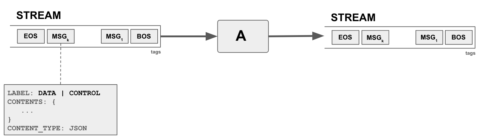
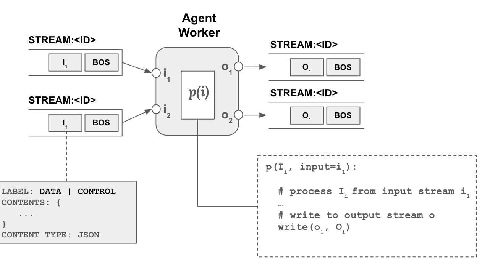
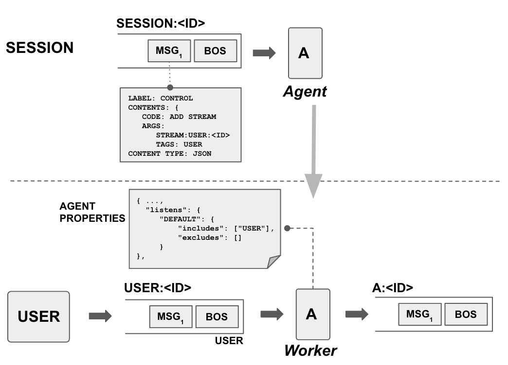
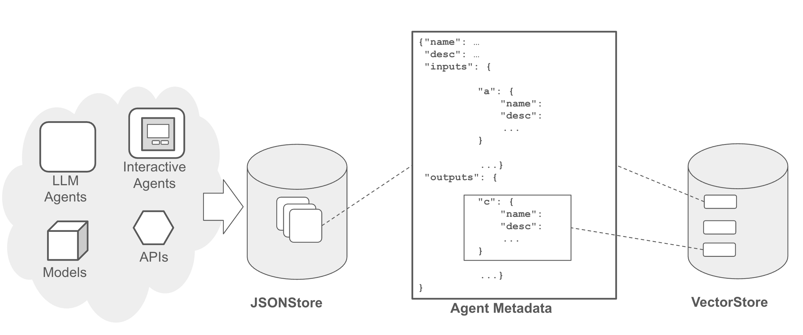
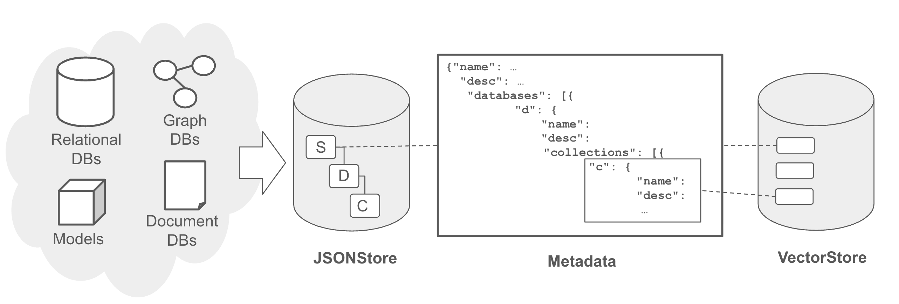
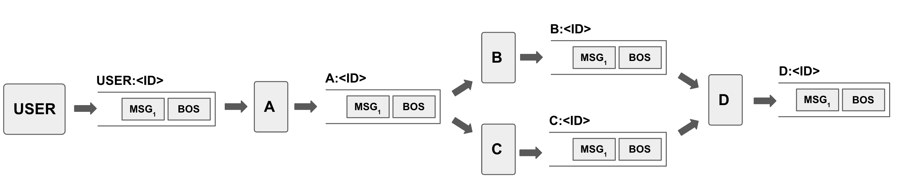

Let's start with introducing concepts in blue.

---
# concepts

## streams
The central "orchestration" concept in Blue is a `stream`. A stream is essentially a continuous sequence of messages (data, instructions) that can be dynamically produced, monitored, and consumed. For example, a temperature sensor can spit out the current temperature every minute to a stream. In our context, a user typing in text in a chat, for example, asking a question can be a stream, where each word is transmitted as they are typed. An LLM generating text can be another stream, and generated text can be output as they are being generated. 

In blue, streams are used in multiple places. Agents consume streams and produce their output into streams. Sessions are also streams, capturing events in the session as a sequence, for example agents joining and leaving a session, producing output data,  are announced as a message in the session stream. Planners (or any other agent) instructing other agents to do work is also a message in the stream. As such streams are the main way of passing data and instructions between agents, where an agent can produce a stream (data and instructions) and another agent can consume from the stream.

Messages in streams can be data and control messages, with supported data types of integer, string, and JSON objects. Messages contain three parts: (1) Label: DATA or CONTROL (2) Contents: Data (3) Content Type. For example, to output a string, the label of the message will be `DATA`, content type will be `STR`, and with the content as the string. 

Streams are tagged by the agent which created the stream. Tags serve multiple purposes but mainly to allow other agents to determine if they are interested to listen to stream.

## agents
The central "compute" concept in blue is an agent. An agent basically spawns a worker to monitor to a stream, if it decides to act on it, can process the data and produce output into another stream(s). There might be yet another agent monitoring the output of the first agent and do something on top, and so on. Agents can have multiple input and outputs. Each input and output is a separate stream. 

Each input parameter defines  a `listens` property which define `includes` and `excludes` rule to determine which streams to listen to, for each input parameter. Each output parameter defines a `tags' property which define which tags to add to the stream based on the output produced. 

Agents also have a set of properties which defines options and settings regarding how an agent will operating. Most of the properties are specific to the agent, for example they can specify a model to use.

### worker
A worker is a thread of an agent that is basically dedicated to processing a specific input stream for an input parameter. How a worker should process the input stream (processor function) is defined by the agent. Similarly, an agent's properties are also passed on to any of its workers.

### tools
Any agent can use tools from the tool registry (see below). Tools are essential functions that an agent can call. For example, an agent that needs some calculations done, can use tools registred in the tool registry to do calculations such as add, subtract, etc. Tool use is not just limited to LLM based agents but any agent can get some computation done through tool calling. Tools can be spread across a number of servers defined in the registry.

## session
The central "context" concept in Blue is a `session`. A session is initiated by an agent, typically a user agent, and continously expanded by other agents responding to the initial stream and other streams in the session. Agents are added to a session to orchestrate a response to the initial user input. Once added an agent can listen to any `stream` in the session and decide to follow-up and process data in the stream to produce more streams in the session.

Above picture shows the process in more detail. The user agent creates a new stream and announces it in the session stream through a control message, `ADD STREAM` and specifies the stream's id as well as its tags. Another agent listening to the session stream sees this event and decides to listen to the user stream as its properties contains a listen property that includes `USER` tag.

## memory
Agents (i.e. agent workers) can store and share data among each other. Data is stored to and retrieved from the `shared memory` at three levels of scope: (a) session (b) stream (c) agent. 

- A worker can put data into the `session memory` which can be seen and retrieved by any agent and its worker in the session. 
- A worker can further limit the scope of the data to a specific stream, where data can be seen only by agents (workers) which are working on that specific stream. This is the `stream memory`. 
- Finally, a worker can put data into the private `agent memory`  where it can only be seen by the workers of the agent itself.

## registries

A registry is essentiually a catalog. As such registries contain data about registered entries, which can be any compute and other related resources. Registries support browsing, searching and in some cases using the resources through registry. 

Blue has a number of registries that help operations:
* Agent Registry: All agents available along with descriptions, properties, input and output parameters, derived agents.
* Data Registry: All data available for use, along with descriptions, statistics, and data entities it contains.
* Tool Registry: All tools available for agents to use, along with descriptions, signatures.
* Operator Registry: All operators available for agents and planners to use, to perform data operations.
* Model Registry: Models along with descriptions, statistics.

### agent registry 

An agent registry stores and organizes metadata about agents, including their descriptions, input and output parameters, stream inclusion/exclusion rules, deployment information such as docker images, deployment configurations, along with other properties. 

Agent registry facilitates search and query for efficient management and retrieval of agent metadata. Agent registry can be queried and searched by any agent.
Users can interact with the registry through a web interface. They can register new agents, update metadata, derive new agents from existing ones, and browse
and search the registry. This interface provides comprehensive functionality for managing agents within the ecosystem.

### data registry

Analogous to an agent registry, data registry stores metadata of data in the ecosystem, and as such is a key touchpoint to the existing data infrastructure of a company. A data registry plays a crucial role in facilitating search and discovery of multi-modal  data across different levels such as lakehouse, lake,
source system, database, and table. It encompasses various data types including documents, relational databases, graph databases, and key-value stores. 

Metadata within a data registry typically includes names, descriptions, and details about data at various levels of granularity (e.g., tables within a database), encompassing data schema and db connection specifics. The registry also incorporates vector metadata, which captures embeddings derived from
learned representations of metadata (e.g., schema details), data contents (e.g., values), structural elements (e.g., schema relationships). 

### tool registry

Tool registry catalogs all available tools (e.g. functions, APIs) in the ecosystem distributed over many servers. 

Currently, blue supports:
* local tools: functions that execute in the same runtime environment
* ray tools: functions that can remotely execute in a ray cluster
* mcp tools: functions that are hosted on an MCP server

Irrespective of the tool server backend, all tools are represented in a similar fashion in the tool registry, which contains metadata such as tool descriptions, function signatures, return data, along with descriptions of each. Like other registries it also supports search and discovery across servers, thus facilitating better tool use. For example, agents can pull only relevant tools for the task.

### operator registry

Operator registry likewise catalogs all available operators. In blue, operators are actually tools but specialized for data processing. Furthermore they share the same signature such that operator chaining can be utilized for complex data processing workflows. 

Like tools operators can also be local, ray, or MCP-based.

Operators can be manually put together to process data or used through a planner that automatically creates a data plan comprised of operators.

### model registry 

Model registry catalogs avalaiable models. Like other registries it stores metadata about the available models, and supports search and discovery.

## plans, planners

One key question is how to put together a number of resources (e.g. agents, operators, etc.) to perform more complex work. As noted above blue streams can contain instructions, for example for other agents to execute and process data in a stream. While this enables chaining at a low-level, blue also supports plans for agentic plans and data pipelines, where more complex work can be supported. Both agentic plans and data pipelines have the same underlying plan representations (see DAG Utils, Plan), they further specialize for specific workflows.

## task plans, planners

As discussed above, while blue architecture and streams enables agents to operate autonomously using stream tags and listener approach, in open-ended
scenarios such as conversational interactions, a task planner is essential to guide meaningful discourse. 

A agentic task plan can have a number of inputs, outputs, and agents that connect inputs to outputs in a sequence. Connections can also be defined between agents, connecting an agent's output to another agent's input, as shown below:

A task planner interprets user requests and devises a task plan that available agents can execute on plan steps and pass on data and instructions
to other agents in a workflow manner. To seamlessly integrate into the architecture, we model the task planner as an agent itself. It listens to the initial user stream and formulates a task plan structured as directed acyclic graphs (DAGs) connecting agent input and outputs, and emits the plan into a stream. Each
node within these DAGs represents a sub-task assigned to a specific agent. 

The task planner utilizes metadata sourced from the agent registry to identify suitable agents for each sub-task. Once this DAG is formulated, similar to other agents, the task planner outputs the plan to a stream to be executed, which is picked up by a task coordinator agent. [Coordinator](/lib/blue/agents/coordinator.py) agent is reponsible for the execution of the plan, i.e. issueing instruction messages for agents to execute and tracking progress.

In blue, a task planner can be interactive, initially presenting a plan to the user, in text form or as a UI, facilitating collaborative planning. The plan can also be dynamic and incremental, meaning it evolves step by step rather than being predetermined in its entirety. 

See blue examples repo for an experimental task planner.

## data planner

A data planner operates similarly but is focused on data processing. Given input data and task (e.g. question/answer) the data planner utilizes available operators (e.g. NL2SQL, JOIN) to create a plan and execute it. Data planner can be used by any agent, including the task planner.

Data planner in blue is currently an experimental utility. See [Data Sources and Processing](lib/src/blue/data) for more details.

 
 

