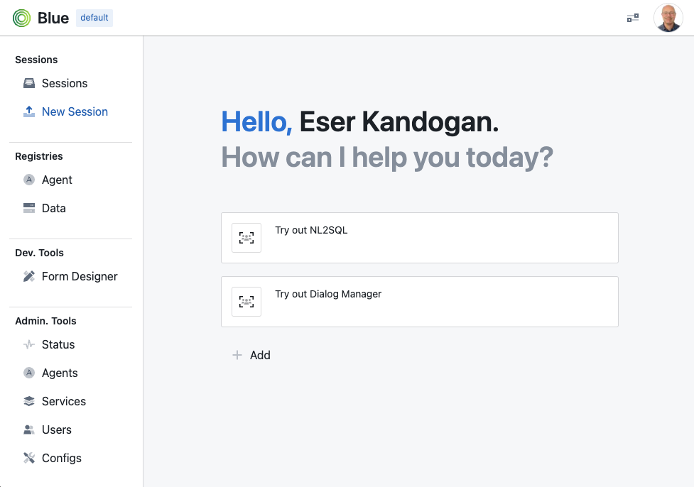

# installation

Blue can be deployed in two modes: (1) `localhost` (2) `swarm` mode. `localhost` is more suitable for trying blue out and for development and `swarm` mode is more suitable for staging and production deployments. Below, we describe how you can install blue in `localhost` mode. See [Swarm Deployment](SWARM-DEPLOYMENT.md) for deployment in `swarm` mode when we discuss production mode of deployment.

## requirements

### software

* docker: Blue requires docker to build and run the infrastructure and agents. To develop on your local machine you would need to install docker engine from https://docs.docker.com/engine/install/ (Supported Versions: Docker Engine 27.5 and Docker Desktop 4.38)
* python: Blue develpers API is currently only available in Python (Supported Versions: Python 3.9)

### hardware

Below are recommended minimums for installation:
* 16GB Memory
* 128GB Disk Space

On AWS a minimum recommended instance type is t3.xlarge. 

### os/platforms

Below are supported platforms with existing images on docker hub:
* linux/arm64/v8,linux/arm64,linux/arm/v7,linux/amd64,linux/amd64/v2,linux/amd64/v3,linux/amd64/v4,linux/386

### 3rd party APIs

* openai: Some of the agents use OpenAI as such to try them you would need OPENAI_API_KEY that will be necessary to configure during installation
* docker hub: For agent development it is recommended that images are published to docker hub image repository.

## download

Most convenient way to install and configure blue is through its CLI (`blue-cli`). In this option, you would not need to build any images as they will be downloaded from docker hub. 

Another approach is through cloning code from this repo, building images and manually configuring. We recommend following blue-cli approach for most people at first and then try cloning for development.

### installation through `blue-cli`

#### install blue-cli
To download and install `blue-cli`, you can pip install it as shown below. It is highly recommended to create a virtual environment (e.g. `venv`) to avoid any conflicts and also upgrade pip (`pip install --upgrade pip`) first:

```
$ pip install --no-cache --extra-index-url  http://10.0.160.75:8888/simple/ --trusted-host 10.0.160.75 blue_cli==0.9
```

`blue-cli` also installs `blue-py`, the python library for blue development.

Once installed, you can invoke blue cli, for example:

```
$ blue
```

This would list the various blue commands, as shown below:
Usage: blue [OPTIONS] COMMAND [ARGS]...
```
Options:
  --help  Show this message and exit.

Commands:
  platform  command group to interact with blue platforms
  profile   command group to interact with blue profiles
  service   command group to interact with blue services
```

#### configure blue profile 

To use `blue-cli` most conveniently you need to create a blue profile, which captures profile specific configuration of the blue deployment. By default `default` profile is automatically created which you can see from the output of:

```
$ blue profile ls
name
* default
```

The * next to the default profile entry indicates that it is the currently selected profile. This is a convenience as you would not need to specify `--profile_name` option with each subsequent command.

To configure the selected profile:
```
$ blue profile config
```

This will ask you a number of questions with you can skip just using the default values, such as:
- `BLUE_INSTALL_DIR`, directory where blue is installed (only used for during development)
- `BLUE_DATA_DIR`, directory hosting data for blue services, will be used to create a docker volume and map to this directory
- `BLUE_DEV_DOCKER_ORG`, docker org to push/pull blue agents and services, use your own org if you develop your own agents, otherwise use `megagonlabs`  
- `BLUE_CORE_DOCKER_ORG`, docker org to push/pull core blue components, often, `megagonlabs`

Once you configure you can see the entire profile configuration using:

```
$ blue profile show
default
BLUE_INSTALL_DIR      /home/ubuntu/blue
BLUE_DATA_DIR         /home/ubuntu/.blue/data
BLUE_DEV_DOCKER_ORG   megagonlabs
BLUE_CORE_DOCKER_ORG  megagonlabs
```

Even though BLUE_INSTALL_DIR is part of the profile, you do not need to clone repository. The configuration is only used during development.

You can also just change any specific configuration, for example: `blue profile config BLUE_DATA_DIR /home/ubuntu/blue_data`

#### configure blue platform

In the next step you will need to configure platform specific configuration. To do so:
```
$ blue platform config
```

As before you will most likely accept the default values for these configuration options. 

The only configuration without a default value is BLUE_EMAIL_DOMAIN_WHITE_LIST, which is a comma separated list of email domains allowed to sign in (through Google Signin).

In general, `platform` commands are very similar to `profile` commands. For example, you can use `blue platform show` to list platform configuration.

#### install platform

To install platform, you can run (you may need to `docker login` before if your repos are private):

```
$ blue platform install
```

This will download all docker images used in the deployment, including base agent images.

#### start platform

To start platform, you can run:
```
$ blue platform start
```

This will run the redis backend, api server, and the web application server for blue. In addition, a postgres container is brought up to host data for some of the example agents.

If you type `docker ps` you should see four containers running, similar to below:
```
$ docker ps
CONTAINER ID   IMAGE                                       COMMAND                  CREATED        STATUS        PORTS                                                 NAMES
081a9c8e59a8   megagonlabs/blue-platform-frontend:v0.9   "docker-entrypoint.s…"   2 days ago     Up 2 days     0.0.0.0:3000->3000/tcp, :::3000->3000/tcp             frosty_knuth
2233a2c7cde9   megagonlabs/blue-platform-api:v0.9        "sh -c 'uvicorn serv…"   2 days ago     Up 2 days     0.0.0.0:5050->5050/tcp, :::5050->5050/tcp             hardcore_jemison
79c773d9060d   redis/redis-stack:latest                    "/entrypoint.sh"         2 days ago     Up 2 days     0.0.0.0:6379->6379/tcp, :::6379->6379/tcp, 8001/tcp   bold_bhaskara
cc0670acfc76   postgres:16.0                             "docker-entrypoint.s…"   18 hours ago   Up 18 hours   0.0.0.0:5432->5432/tcp             eager_ishizaka
```

#### change user role

As you are trying out blue to see full functionality of blue it is recommended that you run it in admin mode, which will give you rights to deploy agents, add/remove users, monitor system performance, and more. To do so:

```
$ blue platform config BLUE_USER_ROLE admin
```

This would launch a web browser for you to sign in. Once signed in your role will be changed to `admin`.

#### start services

Optionally, at this point you can also start some of the blue services that some agents use, for example the `OPENAI` service. To do so:

```
$ blue service --service_name OPENAI create
```
and the configure it:
```
$ blue service  --service_name OPENAI config
```

Below is the recommended configuration:
```
$ blue service --service_name OPENAI show
OPENAI
PORT_SRC        8001
PORT_DST        8001
IMAGE           megagonlabs/blue-service-openai:v0.9
OPENAI_API_KEY  <your key>
```

For `OPENAI` and other services that require additional service-specific configurations you can config them separately, e.g. for `OPENAI` you would need to configure `OPENAI_API_KEY`
```
$ blue service --service_name OPENAI config OPENAI_API_KEY  <your_key>
```

To install (downloads service image) and start (start running service containers) type:
```
$ blue service  --service_name OPENAI install
$ blue service  --service_name OPENAI start
```

If you type `docker ps` you should see now an additional containers running, similar to below:
```
45b6488db428   megagonlabs/blue-service-openai:v0.9      "python openai_servi…"   18 hours ago   Up 18 hours   0.0.0.0:8001->8001/tcp             youthful_galileo
```

#### testing

At this point blue is ready to use. You can test your deployment by browsing to the blue web application hosted at http://localhost:3000, if you accepted default configuration. Otherwise, it is `BLUE_PUBLIC_WEB_SERVER`:`BLUE_PUBLIC_API_SERVER_PORT`

You should see:



