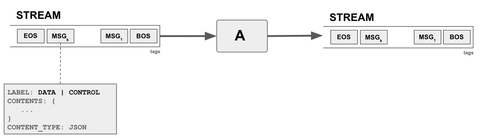
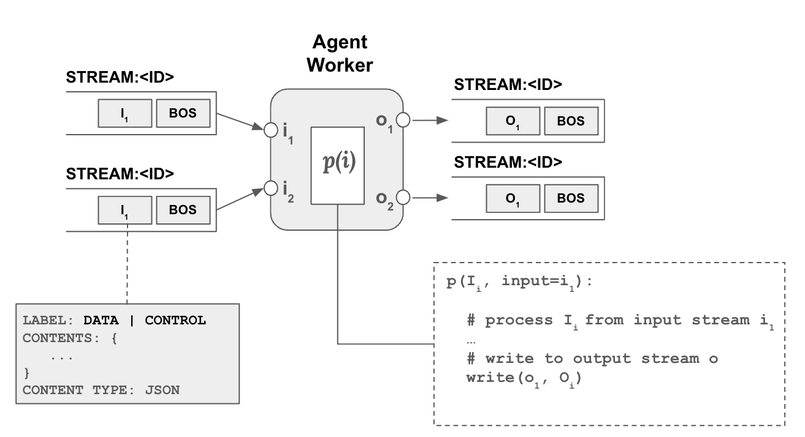

Let's start with introducing concepts in blue.

---
# orchestration concepts

## streams
The central "orchestration" concept in Blue is a `stream`. A stream is essentially a continuous sequence of messages (data, instructions) that can be dynamically produced, monitored, and consumed. For example, a temperature sensor can spit out the current temperature every minute to a stream. In our context, a user typing in text in a chat, for example, asking a question can be a stream, where each word is transmitted as they are typed. An LLM generating text can be another stream, and generated text can be output as they are being generated. 

In blue, streams are used in multiple places. Agents consume streams and produce their output into streams. Sessions are also streams, capturing events in the session as a sequence, for example agents joining and leaving a session, producing output data,  are announced as a message in the session stream. Planners (or any other agent) instructing other agents to do work is also a message in the stream. As such streams are the main way of passing data and instructions between agents, where an agent can produce a stream (data and instructions) and another agent can consume from the stream.

Messages in streams can be data and control messages, with supported data types of integer, string, and JSON objects. Messages contain three parts: (1) Label: DATA or CONTROL (2) Contents: Data (3) Content Type. For example, to output a string, the label of the message will be `DATA`, content type will be `STR`, and with the content as the string. 

Streams are tagged by the agent which created the stream. Tags serve multiple purposes but mainly to allow other agents to determine if they are interested to listen to stream.

## agents
The central "compute" concept in blue is an agent. An agent basically spawns a worker to monitor to a stream, if it decides to act on it, can process the data and produce output into another stream(s). There might be yet another agent monitoring the output of the first agent and do something on top, and so on. Agents can have multiple input and outputs. Each input and output is a separate stream. 

Agents have a set of properties which defines options and settings regarding how an agent will operating. Most of the properties are specific to the agent, for example they can specify a model to use. There are also properties that each agent have. For example,  all agents  define a `listens` property which define `includes` and `excludes` rule to determine which streams to listen to, for each input parameter.

### worker
A worker is a thread of an agent that is basically dedicated to a specific input stream for an input parameter. How a worker should process the input stream (processor function) is defined by the agent. Similarly an agent's properties are also passed on to any of its workers.

## session
The central "context" concept in Blue is a `session`. A session is initiated by an agent, typically a user agent, and continiously expanded by other agents responding to the initial stream and other streams in the session. Agents are added to a session to orchestrate a response to the initial user input. Once added an agent can listen to any `stream` in the session and decide to follow-up and process data in the stream to produce more streams in the session.

Above picture shows the process in more detail. The user agent creates a new stream and announces it in the session stream through a control message, `ADD STREAM` and specifies the stream's id as well as its tags. Another agent listening to the session stream sees this event and decides to listen to the user stream as its properties contains a listen property that includes `USER` tag.

## memory
Agents (i.e. agent workers) can store and share data among each other. Data is stored to and retrieved from the `shared memory` at three levels of scope: (a) session (b) stream (c) agent. 

- A worker can put data into the `session memory` which can be seen and retrieved by any agent and its worker in the session. 
- A worker can further limit the scope of the data to a specific stream, where data can be seen only by agents (workers) which are working on that specific stream. This is the `stream memory`. 
- Finally, a worker can put data into the private `agent memory`  where it can only be seen by the workers of the agent itself.

 
 