# QuickStart Guide

Blue has a web application that allows you to:

* Configure the platform,
* Browse agent and data registries,
* Add and configure agents and data,
* Create interactive sessions,
* Debug sessions,
* Use developer tools to help develop agents, and
* Perform various administrative tasks

## Home screen

When launched the Blue home screen is shown by default. To get back to the home screen at any time by clicking on the "Blue" icon at the top left of the screen.  In the home screen you can:

1) Launch a session with pre-configured agent groups.
2) Change and add a new agent group.

### Launch a session with pre-configured agent groups.

To launch a session

- Click on the agent group card.
- A new session will be created pre-configured with the set of agents defined in the agent group.

 

To try a few of the demos you can click on one of the cards as shown below:

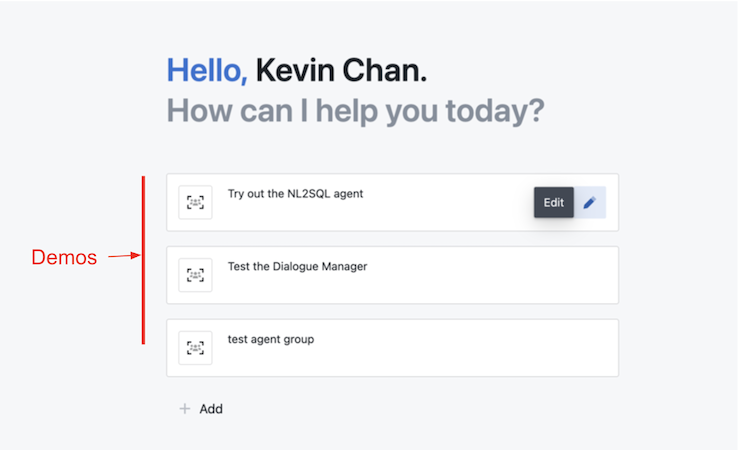

### Change and add a new agent group

To change an existing agent group

- Click on the edit button on the right side of the card.
- To update the description, click on Actions > edit to go to edit mode.
- To update the agents included in the agent group, click the update agents button.

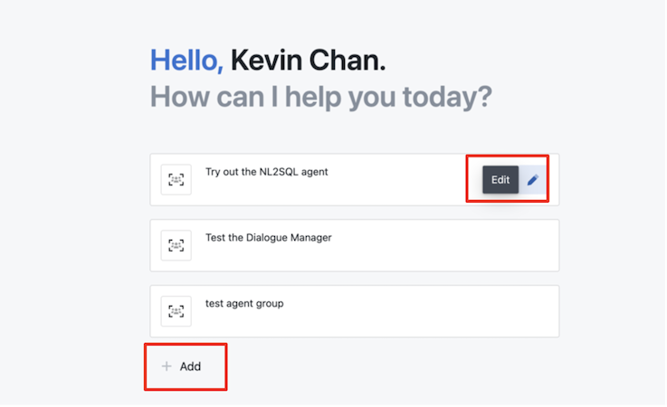

To add a new agent group

- On the home screen click the add button
- Enter the name of the agent group and description.  Please ensure that there are no spaces in the agent group name.
- To add agents to the agent group, click the update agents button.

## Sessions

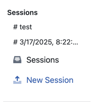

### Create a new session

To create a new session:

- Click on the new session button on the left sidebar
- Select the agents you want to include in your session.
- Click Add and Done buttons.  A session will be created.

### Access and editing existing sessions properties

To access existing sessions on the top of the left side bar, you can either:

- Click on the session name.
- Click on the sessions button which lists all the existing sessions.

To edit an existing session properties
-- click on the session name at the top of the chat window.
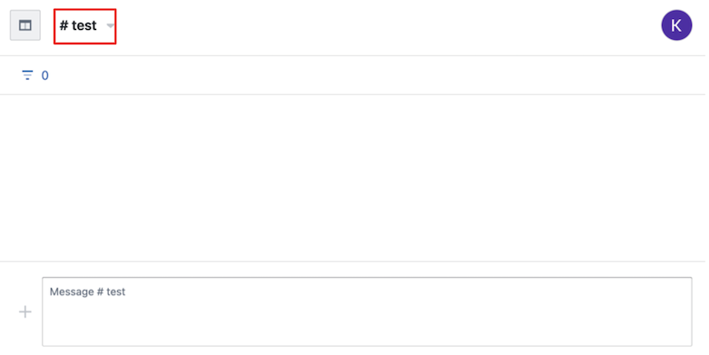

Select the relevant tab to edit the session properties:

- About tab - to change the session name and description.
- Agents tab - to show which agents are currently included in the session.
- Members tab - to add users and show which users are currently included in the session.
- Budget tab - this is reserved for future functionality.
- Data tab - to edit the data used in the session.
- Settings tab - to delete the session.  Note that once you delete this session, its STREAM, DATA and METADATA will be removed.

## Agent registry

Agent registry is a repository that captures the metadata about the agent such as 
- Name & description
- Input
- Output
- Agent Parameters
- Docker Image

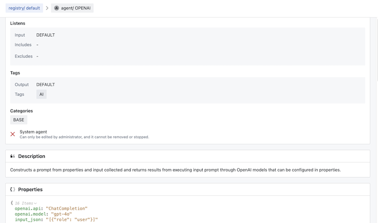

## Data registry
Data registry is a repository of metadata about data elements that blue agents can connect to, search, and browse. Each data element is described with metadata such as name, type, description, properties, and contents.

Data elements in the registry are nested. At the top is a data lake. A data lake consists of a number of data sources (e.g. postgres dbms, mongo server, etc.). Data sources contain databases (e.g. postgres db, mongo db). Databases contain collections (e.g. postgres table, mongo collection, etc.).

Data registry defines the set of data that can be utilized on specific deployments by the agents in that deployment. When deployed each deployment (platform) is paired with a specific data registry. Each data registry has a name that is used in configuring a platform.

Data registry can be utilized by various agents (including planner) to find suitable data. To facilitate that data registry supports parameteric (embeddings) search as well as keyword based search.

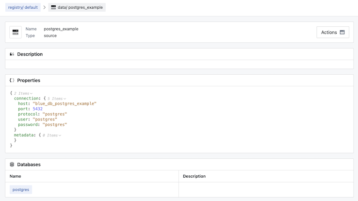

## Developer tools: 
### Form Designer
Developer Tools > Form Designer, enables you to design a form including defining UI schema along with the data schema.  

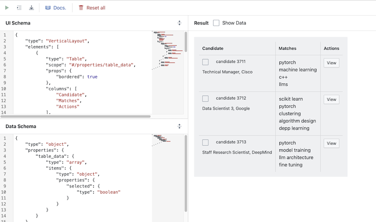

## Admin tools

### Status
Admin Tools > Status, enables you to monitor the performance of components running on blue including:
- Thread information
- Database information 
- Service call counts 
- Service response times
- CPU information
- Memory information
- Processes Information

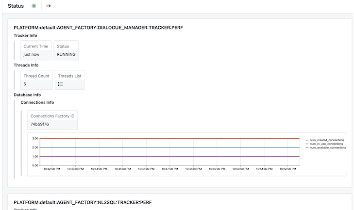

### Agents
Admin Tools > Agents, shows a list of the agents currently running in blue.
- Agent logs - you can view the container logs for the agent by clicking on actions > logs. 
- Delete agent container - you can delete an agent contained by selecting an agent and clicking the delete button. 
- Update agent container - you can update the agent container by selecting the agent and clicking the pull button.  

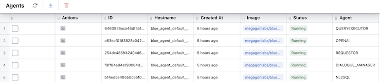

### Services
Admin Tools > Services, show a list of the services that are currently running in blue.  
- Stop service - select the service and click on stop button to stop a service.

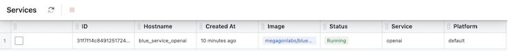

### Users
Admin Tools > Users, shows a list of all the users and you can update:
- User role - maintain a blue users role by selecting the user and clicking the update role/s button. 
- Default user settings - maintain default settings for new users by clicking on the settings button

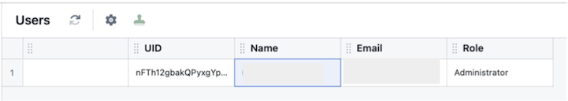

### Config

Admin Tools > Configs, enables you to change Blue configuration via the Blue web application.

- Expiration duration - enables you to edit the length of time (stream, data and metadata) will be retained.  Currently the default and minimum value is 3 days.
