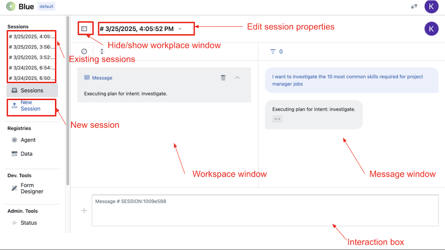

# QuickStart guide

Megagon Blue has a web application where you can:

* [Login to blue platform](#login)
* [Access the home screen](#home-screen)
* [Create interactive sessions](#sessions)
    * [Interact with session window](#interact-with-session-window)
    * [Access and editing existing sessions properties](#access-and-editing-existing-sessions-properties)
* Configuration:
    * [Add and configure agents](#agent-registry)
    * [Add and configure data sources](#data-registry)
* [Access developer tools](#developer-tools)
* [Access admin tools to monitor/debug and configure Megagon Blue platform](#admin-tools)  
* [User settings](#user-settings)

## Login
To login:
- Go to the URL of your instance.  If you have installed locally and accepted the default configuration, the url will be http://localhost:3000. Otherwise, it is http://`BLUE_PUBLIC_WEB_SERVER`:`BLUE_PUBLIC_WEB_SERVER_PORT`
- A "sign in with google" page will appear and please sign in using your google account. Note that login sessions are only valid for 1 hour.

- <u> For admin users </u> - Please sign in with the google account you used during the [installation](LOCAL-INSTALLATION.md) process
- <u> For new users </u>  - Please sign on using a google account within the whitelisted email domain defined in the configuration BLUE_EMAIL_DOMAIN_WHITE_LIST set during the [installation](LOCAL-INSTALLATION.md).  Note that by default new users are created with guest role.  Administrators can grant admin role access using [admin tools > Users](#users)

- Home screen should appear once you have logged in successfully. 

## Home screen

When launched the Megagon Blue home screen is shown by default. To get back to the home screen at any time by clicking on the "Blue" icon at the top left of the screen.  In the home screen you can:

1) [Launch a session with pre-configured agent groups](#launch-a-session-with-pre-configured-agent-groups)
2) [Change and add a new agent group](#change-and-add-a-new-agent-group)

### Launch a session with pre-configured agent groups

To launch a session

- Click on the agent group card.
- A new session will be created pre-configured with the set of agents defined in the agent group.

 

To try a few of the demos you can click on one of the cards as shown below:

Documentation for the demos can be found here:
* [NL2SQL](https://github.com/megagonlabs/blue-examples/tree/v0.9/demos/nl2sql): Translate user input text to SQL and execute it with data in the registry.
* [Dialogue Manager](https://github.com/megagonlabs/blue-examples/tree/v0.9/demos/dialogue_manager): Identify user intent and execute plans
(Note: please ensure that you follow the steps in the "try it out" section of the demo documentation)

### Change and add a new agent group

To change an existing agent group

- Click on the edit button on the right side of the card.
- To update the description, click on Actions > edit to go to edit mode.
- To update the agents included in the agent group, click the update agents button.

To add a new agent group

- On the home screen click the add button
- Enter the name of the agent group and description.  Please ensure that there are no spaces in the agent group name.
- To add agents to the agent group, click the update agents button.

## Sessions

### Create a new session

To create a new session:

- Click on the new session button on the left sidebar
- Select the agents you want to include in your session.
- Click add and done buttons.  
- A new session will be created.

### Interact with session window

* You input text and interact via the interaction box.
* Responses/output and interaction history will be displayed in the message window
* At any time you can add any response/output to the workspace.  This enables you to keep the response/output visible while the message window continues to add interaction history.  
    * Click on the button to hide or show the workplace.

### Access and editing existing sessions properties

To access existing sessions on the top of the left side bar, you can either:

- Click on the session name.
- Click on the sessions button which lists all the existing sessions.

To edit an existing session properties
-- click on the session name at the top of the chat window.

Select the relevant tab to edit the session properties:

- About tab - to change the session name and description.
- Agents tab - to show which agents are currently included in the session.
- Members tab - to add users and show which users are currently included in the session.
- Budget tab - this is reserved for future functionality.
- Data tab - to edit the data used in the session.
- Settings tab - to delete the session.  Note that once you delete this session, its STREAM, DATA and METADATA will be removed.

## Agent registry

Agent registry is a repository that captures the metadata about the agent such as 
- Name & description
- Input
- Output
- Agent Parameters
- Docker Image

### Agent deployment
Before an agent is ready to be used it needs to be deployed.
* In agent registry click on the agent
* If required pull the latest docker image, click on actions > pull
* To deploy, click on actions > deploy

## Data registry
Data registry is a repository of metadata about data elements that blue agents can connect to, search, and browse. Each data element is described with metadata such as name, type, description, properties, and contents.

Data elements in the registry are nested. At the top is a data lake. A data lake consists of a number of data sources (e.g. postgres dbms, mongo server, etc.). Data sources contain databases (e.g. postgres db, mongo db). Databases contain collections (e.g. postgres table, mongo collection, etc.).

Data registry defines the set of data that can be utilized on specific deployments by the agents in that deployment. When deployed each deployment (platform) is paired with a specific data registry. Each data registry has a name that is used in configuring a platform.

Data registry can be utilized by various agents (including planner) to find suitable data. To facilitate that data registry supports parameteric (embeddings) search as well as keyword based search.

### Data source sync

Before a data source can be used you will need to sync the data registry with the data source by clicking on the action button > sync.  The sync action will connect to the database and get the database schema.

## Developer tools 
### Form designer
Developer Tools > Form Designer, enables you to design a form including defining UI schema along with the data schema.  

## Admin tools

### Status
Admin Tools > Status, enables you to monitor the performance of components running on Megagon Blue including:
- Thread information
- Database information 
- Service call counts 
- Service response times
- CPU information
- Memory information
- Processes Information

### Agents
Admin Tools > Agents, shows a list of the agents currently running in Megagon Blue.
- Agent logs - you can view the container logs for the agent by clicking on actions > logs. 
- Delete agent container - you can delete an agent contained by selecting an agent and clicking the delete button. 
- Update agent container - you can update the agent container by selecting the agent and clicking the pull button.  

### Services
Admin Tools > Services, show a list of the services that are currently running in Megagon Blue.  
- Stop service - select the service and click on stop button to stop a service.

### Users
Admin Tools > Users, shows a list of all the users and you can update:
- User role - maintain a blue users role by selecting the user and clicking the update role/s button. 
- Default user settings - maintain default settings for new users by clicking on the settings button

### Config

Admin Tools > Configs, enables you to change Megagon Blue configuration via the Blue web application.

- Expiration duration - enables you to edit the length of time (stream, data and metadata) will be retained.  Currently the default and minimum value is 3 days.

## User settings
You can change your user settings by pressing the settings button on the top right of the window.  The following settings can be set
* Appearance 
    * Dark/light mode
    * Compact sidebar - enabled you to minimize the size of the left sidebar to allow for a wider interaction window
* Session and Messages
    * Show workplace - by default show workspace
    * Expand messages - automatically expand all session messages to show full context.  
    * Conversational view 
* Developer
    * Debugger

### Conversational view
You can use conversational view user settings to show messages on opposite sides mimicking a conversational experience.  

### Debugger 
You can use debugging user settings to show debugger which expands the interactions and shows all the steps performed by Megagon Blue platform.  

