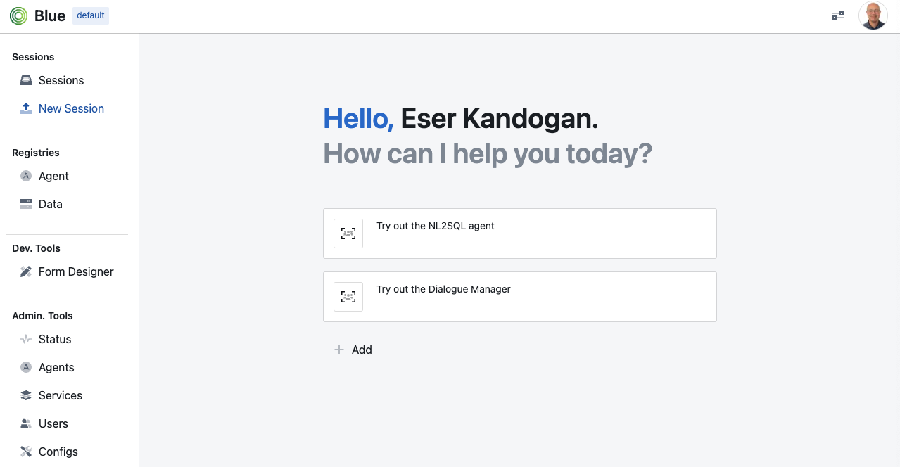

# QuickStart Guide

Blue has a web application that allows you to:
* configure the platform,
* browse agent and data registries,
* add and configure agents and data,
* create interactive sessions,
* debug sessions,
* use developer tools to help develop agents, and
* perform various administrative tasks

## home screen

When launched blue home screen is shown by default. In this screen you can directly launch sessions with pre-configured sessions.
To try out a few of the demos, you can click on any one of the cards, as shown below:

### launching demos from home screen

### configuring home screen

## sessions

## agent registry

## data registry

## developer tools: form designer

## admin tools

## status

## agents

## services

## users

## config
