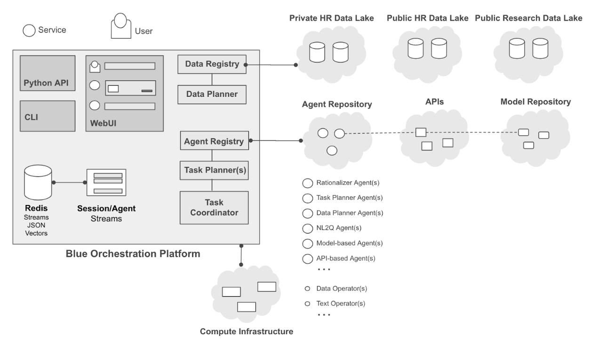
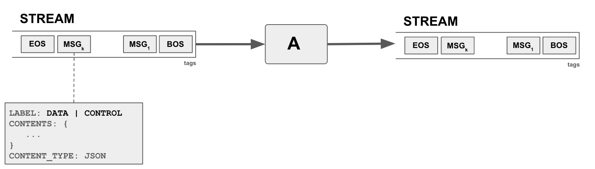

# blue

Blue is an agent orchestration platform to coordinate data and work in an AI system comprised of agents and other components to perform complex tasks with workflows. We are building Blue to explore the design space of agent orchestration systems, to support a variety of use-cases: from fixed workflows to ad-hoc workflows with planners, from purely textual interaction to interactive agents with user interfaces, from non-interactive use cases to conversational interaction, from data and domain-agnostic to data-aware design, and beyond. Blue is designed such that it can be configured to support any of these use cases.

A key target of Blue is enterprise infrastructure, i.e. complement an existing enterprise infrastructure to utilize advanced AI, LLMs, and beyond for enterprise use-cases. We aim to leverage what already exist in the enterprise infrastructure, i.e. existing APIs, models, and data, in their original source, format, and systems and integrate them with new capabilities.

Below is an overview of the Blue infrastructure, with touchpoints to an enterprise infrastructure:



In Blue, key components of the AI system are: 
- data lake(s) to store and query data from, consisting of a multitude of databases 
- data registry, serving as a metadata store for data sources, with capabilities to discover and search data, and eventually query data from the sources
- data planner(s), modeled as an agent, utilizing metadata (performance and beyond) in the data registry, provide crucial functionality to generate query plans
- agent registry, serving as a metadata store for agents, with capabilities to search agent metadata (e.g. descriptions, inputs, outputs)
- agent(s) providing a wide range of functionality, from calling APIs, interfacing with LLMs, to running predictive models, etc. 
- task planner(s), also modeled as an agent, taking initial user/agent input and creating execution plans, utilizing metadata in the agent registry, as well as basic operators to serve as glue between inputs and outputs.
- task coordinator(s), modeled as an agent,coordinate and monitor execution progress, once a plan is created. 
- operators, supporting the need for basic common capabilities such as data transformation and beyond, as executable functions accessible to the coordinator to invoke
- orchestration, supporting infrastructure and streams to govern the flow of data and instructions among all agents within a user session
- a conversational user interface where users can create sessions, add agents to their conversation, interact with them, and accomplish tasks.
- a python API to allow other modalities where a multi-agent system can be utilized programatically, such as developing APIs.

</br>

Sounds interesting? Want to learn more? 

Below is an outline of the documentation on this repo:
* [orchestration concepts](#orchestration-concepts)
* [installation](#installation)
* [hello world example](#hello-world-example)
* [development](#development)
* [demos](#demos)
* [deployment](#deployment)

</br>
</br>

Let's start with introducing concepts in blue.


---
# orchestration concepts

## streams
The central "orchestration" concept in Blue is a `stream`. A stream is essentially a continuous sequence of messages (data, instructions) that can be dynamically produced, monitored, and consumed. For example, a temperature sensor can spit out the current temperature every minute to a stream. In our context, a user typing in text in a chat, for example, asking a question can be a stream, where each word is transmitted as they are typed. An LLM generating text can be another stream, and generated text can be output as they are being generated. 



In blue, streams are used in multiple places. Agents consume streams and produce their output into streams. Sessions are also streams, capturing events in the session as a sequence, for example agents joining and leaving a session, producing output data,  are announced as a message in the session stream. Planners (or any other agent) instructing other agents to do work is also a message in the stream. As such streams are the main way of passing data and instructions between agents, where an agent can produce a stream (data and instructions) and another agent can consume from the stream.

Messages in streams can be data and control messages, with supported data types of integer, string, and JSON objects. Messages contain three parts: (1) Label: DATA or CONTROL (2) Contents: Data (3) Content Type. For example, to output a string, the label of the message will be `DATA`, content type will be `STR`, and with the content as the string. 

Streams are tagged by the agent which created the stream. Tags serve multiple purposes but mainly to allow other agents to determine if they are interested to listen to stream.

## agents
The central "compute" concept in blue is an agent. An agent basically spawns a worker to monitor to a stream, if it decides to act on it, can process the data and produce output into another stream(s). There might be yet another agent monitoring the output of the first agent and do something on top, and so on. Agents can have multiple input and outputs. Each input and output is a separate stream. 

Agents have a set of properties which defines options and settings regarding how an agent will operating. Most of the properties are specific to the agent, for example they can specify a model to use. There are also properties that each agent have. For example,  all agents  define a `listens` property which define `includes` and `excludes` rule to determine which streams to listen to, for each input parameter.

### worker
A worker is a thread of an agent that is basically dedicated to a specific input stream for an input parameter. How a worker should process the input stream (processor function) is defined by the agent. Similarly an agent's properties are also passed on to any of its workers.


## session
The central "context" concept in Blue is a `session`. A session is initiated by an agent, typically a user agent, and continiously expanded by other agents responding to the initial stream and other streams in the session. Agents are added to a session to orchestrate a response to the initial user input. Once added an agent can listen to any `stream` in the session and decide to follow-up and process data in the stream to produce more streams in the session.

## memory
Agents (i.e. agent workers) can store and share data among each other. Data is stored to and retrieved from the `shared memory` at three levels of scope: (a) session (b) stream (c) agent. 

- A worker can put data into the `session memory` which can be seen and retrieved by any agent and its worker in the session. 
- A worker can further limit the scope of the data to a specificc stream, where data can be seen only by agents (workers) which are working on that specific stream. This is the `stream memory`. 
- Finally, a worker can put data into the private `agent memory`  where it can only be seen by the workers of the agent itself.


</br>
</br>

Want to get started? Follow the installation steps below.. 


---
# installation

Blue can be deployed in two modes: (1) `localhost` (2) `swarm` mode. `localhost` is more suitable for development and `swarm` mode is more suitable for staging and production deployment. Below, we describe how you can install blue in `localhost` mode and further down we will talk about `swarm` mode when we discuss production mode of deployment.

## requirements
Blue requires docker engine to build and run the infrastructure and agents. To develop on your local machine you would need to install docker engine from 
https://docs.docker.com/engine/install/

## configuration

Most of blue scripts require a number of parameters. While you can use the defaults, configuring your setup can be more easy, if you set environment variables for your choices. Below is the list of environment varibles:

- `BLUE_INSTALL_DIR`, directory containing blue source code, for example, `/Users/me/blue`
- `BLUE_DEPLOY_TARGET`, deployment target, `localhost` (default) or `swarm`
- `BLUE_DEPLOY_PLATFORM`, platform name, `default` (default)
- `BLUE_DEPLOY_VERSION`, deployment version, `latest` (default)
- `BLUE_PUBLIC_API_SERVER`, server address for the API , for example, `localhost:5050`
- `BLUE_DATA_DIR`, directory hosting daa for blue services, for example `${BLUE_INSTALL_DIR}/data`
- `BLUE_AGENT_REGISTRY`, agent registry name, `default` (default)
- `BLUE_DATA_REGISTRY`, data registry name, `default` (default)


Use of utilities such as [direnv](https://direnv.net/) is strongly encouraged to help management environment variables.

## setup

### data volume setup


A data volume is added to several services (agents, API, etc.) where common data such as models can be stored within a platform (e.g. `default`). To create a data volume on your development environment, run:

```
$ cd platform/scripts
$ ./create_data_volume.sh --platform default
```
This will create a directory called `default` under the `$BLUE_DATA_DIR` directory, and create a volume on that directory.

#### data volume contents

In the default configuration some of the components of blue require data and models, stored in the data volume. Below are the steps to put them into the volume you just created:

```
$ brew install git-lfs
$ git lfs install
$ cd $BLUE_DATA_DIR/$BLUE_DEPLOY_PLATFORM
$ mkdir models
$ cd models
$ git clone https://huggingface.co/sentence-transformers/paraphrase-MiniLM-L6-v2
``` 

## build

Even when running blue locally during development, many components of blue should be run as docker containers. As such it is important to build the various docker images first.

### building agents

To build docker images for all agents, run:
```
$ cd agents
$ ./docker_build_all_agents.sh
```

Or if you can also build images for certain agents, you can do so by first changing to the directory for the agent, for example, to build user agent only:
```
$ cd agents/user
$ ./docker_build_agent.sh
```

### building services 

To build docker images for all services that agents use, run:
```
$ cd services
$ ./docker_build_all_services.sh.
```

Or if you can also build images for certain servoces, you can do so by first changing to the directory for the servoce, for example, to build openai service only:
```
$ cd services/openai
$ ./docker_build_service.sh
```


### building platform components

The key components in platform that require building are the API and the frontend.

#### building API

Run:
```
$ cd platform/api
$ ./docker_build_api.sh
```

#### building frontend

Before building the frontend you need to update `secrets/fa.token`, please contact eser@megagon.ai or rafael@megagon.ai to get the token.

Run:
```
$ cd platform/frontend
$ ./docker_build_frontend.sh
```

While not necessary to build images for agent and data regisries, if you would like to use them independently, you could build images for them as well. Simply `cd agent_registry` and `./docker_build_agent_regisry.sh` to build agent registry and `cd data_registry` and `./docker_build_data_regisry.sh` to build data registry. See more in [agent_registry](platform/agent_regisry) and [data_registry](platform/data_registry).

## deployment

To deploy blue locally, with the default options, run:
```
$ cd platform/scripts
$ ./deploy_platform.sh
```

To test your deployment you can run:
```
$ docker ps
```

and the list should contain three containers running: redis, api , and frontend

If you want to see it in action on the web, you can bring up the frontend by browsing to `http://localhost:3000` and the API documentation on `http://localhost:5050/docs#/`


</br>
</br>

---
# hello world example

Let's try running a very basic example. In this example, a user agent emits some text and a counter agent simply listens to the user agent and returns the number of words in the text from the user agent.

Note: Before proceeding forward, we should let you know that you would rarely run agents through python scripts as below. It is more preferrable that you build docker images and deploy them either through the web interface or command-line interface. 

Note: Prerequisites. Make sure to run `build_agent.sh` under `agents/user` and `agents/counter`, and then install the requirements.txt through `pip install -r src/requirements.txt` in both of these directories.

Now we can go back to the `hello world` example...


To input some text through the user agent, run:
```
$ cd agents/user
$ python src/user_agent.py --interactive
[...]
INFO:root:Started consumer USER for stream SESSION:2f6ecafe
[...]
Enter Text: Hello, world!
```

Then copy the session the USER agent created (i.e. SESSION:2f6ecafe)  so that another agent can participate in the same session:

```
$ cd agents/counter
$ python src/counter_agent.py --session SESSION:2f6ecafe --loglevel ERROR
[...]
```

In the above example, the user enters some text and another agents listens to the sesssion the user agent works in, when the user agent creates a stream and enter text, the counter agent above picks up the stream and computes the length of the user stream and outputs that into another stream in the session. You can see the log output from the counter agent to see its output. You can also see the demo stream contents using RedisInsight or use Observer agent (see [Observer](agents/observer)).

Now let's do a more sophisticted 'hello world!'

A more sophisticated example would be where the agent doesn't do the heavy work itself (counting is hard!) but merely makes a call to a service over websockets. To run an example like that you first need to bring up a web service and then run the agent that talks to the service. Let's first build the service as a docker image:

```
$ cd services/websocket_counter
$ ./docker_build_service.sh
```

Then deploy the service:
```
$ cd platform/scripts
$ ./deploy_service.sh --service websocket_counter --port_mapping 8001:8001 --image blue-service-websocket_counter:latest
```

And lastly run the agent:
```
$ cd agents/websocket_counter
$ python src/websocket_counter_agent.py --session SESSION:2f6ecafe --properties='{"counter.service":"ws://localhost:8001"}'
```


</br>
</br>

---

# development

To learn more about developing agents yourself please go to [agents](agents) for more details.


</br>
</br>

---

# demos

There are more demos in the [demos](demos) folder. Please try them on your own following the documentation in the respective folders.

</br>
</br>

---

# deployment

B
The main difference between a `localhost` deployment and a `swarm` deployment is that there are multiple compute nodes where various components can be deployed to. Another key difference is that ccomponents are added as a service where each can be configure with multiple scalability configurations and other service options.

## clusters


As show above at the minimum there is a cluster of four compute instances, labeled `platform`, `db`, `agent`, and `service`. 

The mapping various components to the compute cluster is done through deployment constraints (see below swarm setup). In the current setup the cluster has nodes with labels: db, platform, agent, and service. Redis container is deployed on the db nodes, API and frontend deployed on the platform node,  agent containers are deployed to the agent node, and finally any service that can be used by agents is deployed on service node. Communication between the various components is done through an overlay network dedicated to the plaform. The overlay network enables easy communication among components with components simply reachable through their service names (see https://docs.docker.com/network/drivers/overlay/)

For larger deployments and complex scenarios, multiple nodes can be designated to each function, and one can introduce different labels to define complex deployment targets.

Each deployment of the platform is named, with a separate network so that each component in the platform is addressible using the same hostname within its specific network.

## requirements

As in the `localhost` deployment mode, the production of Blue also requires docker engine to build and run the infrastructure and agents. In addition, docker swarm is used for creating a production infrasructture and docker hub is used as a repository of docker images.

## configuration

Below are the environment variables and typical settings for staging and production:

- `BLUE_INSTALL_DIR`, directory containing blue installation, used in deployment scripts
- `BLUE_DEPLOY_TARGET`, deployment target, swarm should be used for staging and 
- `BLUE_DEPLOY_PLATFORM`, platform name, reflecting specific deployment/use case
- `BLUE_PUBLIC_API_SERVER`, server address for the REST API , for example, `10.0.160.75:5050`
- `BLUE_DATA_DIR`, directory hosting daa for blue services, for example `${BLUE_INSTALL_DIR}/data`, used in deployment scripts
  
## setup

### swarm setup

First, you need to create multiple compute (e.g. AWS EC2) instances. For this step, please refer to your cloud providers documentation. For AWS, you can find it here: https://aws.amazon.com/ec2/getting-started/. In addition, to allow some easy data sharing you can create a filesystem to share among the compute instances. For AWS EFS, refer to: https://aws.amazon.com/efs/getting-started/. 

Once you have several compute instances, you can build a swarm consisting of manager and worker nodes. As part of blue platform scripts, we have convenience scripts to help you initiate a swarm, add nodes, and label them for blue deployments. For more details on swarm you can read: https://docs.docker.com/engine/swarm/

To initiate a swarm, run below command on the designated manager node:
```
$ cd platform/scripts
$ ./init_swarm.sh /mnt/efs/fs1/blue_swarm
```

Once completed, you will have the manager and worker tokens saved as `.manager.token` and `.worker.token`.  You can then use to go to other compute instances and join the swarm. You can either copy these files or share them via shared filesystem:

Before running below commands make sure `.manager.token` and `.worker.token` files are transferred and are in the same directory.

To join as worker, run:
```
$ cd platform/scripts
$ ./join_swarm.sh worker /mnt/efs/fs1/blue_swarm
```
To join as manager run `./joinswarm.sh manager`. To leave swarm run `./leave_swarm.sh`

Once all nodes are in the swarm, label them so that when blue is deployed they go to the appropriate node. Blue uses by default four labels: `platform`, `db`, `agent` and `service`

For each node label them with one of the above labels:
```
$ cd platform/scripts
# ./add_label.sh <label> <node>
```
where <label> is either `platform`, `db`, `agent` or `service` and <node> is the node id when you run `docker node ls`.

### data volume setup

For the swarm mode it is best to utilize a shared filesystem as the location of the data folder. Set `BLUE_DATA_DIR` to a folder on such a shared filesystem. Next, to create a data volume, run:

```
$ cd platform/scripts
$ ./create_data_volume.sh --platform default
```

This will create a directory called default under the $BLUE_DATA_DIR directory, and create a volume on that directory.

## build / publish

Beyond building docker images for agents and platform componens, as in the `localhost` mode, in the `swarm` mode the images need to be published to docker hub. To do so, once built, you need to run publish scriips.

For example, to publish all agent images:
```
$ cd agents
$ ./docker_publish_all_agents.sh
```

Likewise, for API and frontend run their respective scriipts, `docker_publish_api.sh` and `docker_publish_frontend.sh` in their directories.

## deployment

To deploy blue on a swarm, with the default options, run:
```
$ cd platform/scripts
$ ./deploy_platform.sh --target swarm
```

To test your deployment you can run:
```
$ docker service ls
```

and the list should contain three services running: redis, api , and frontend

If you want to see it in action on the web, you can bring up the frontend by browsing to `http://<platform_ip_address>:3000` and the API documentation on `http://<platform_ip_address>:5050/docs#/`

