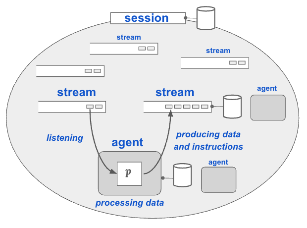

# What is Blue?

Blue is an agent orchestration platform for building and deploying applications with agentic workflows for the enterprise. 

A key target use-case of Blue is enterprise, i.e. integrate an existing enterprise infrastructure with advanced AI, LLMs, and beyond for a wide-variety of enterprise use-cases. We aim to leverage what already exist in the enterprise infrastructure, i.e. existing APIs, models, and data in their original source, format, and systems and couple them with new capabilities.

Blue is currently a research project to explore the design space of agent orchestration systems, to support a variety of use-cases: from data and domain-agnostic to data-aware design, from non-interactive use cases to conversational interaction, from fixed workflows to ad-hoc workflows with planners, from purely textual interaction to interactive agents with user interfaces, and beyond. 

# How does Blue work?

To help facilitate ‘Agentic for Enterprise’ we are introducing several concepts in the design of our framework, including:
- **Streams** to facilitate data, control, and communication among agents
- **Messages** in streams to standardize of data and instructions for agents
- **Registries** to capture metadata about data, agents and beyond
- **Session** to provide context (and shared memory) for computation
- **Plans** to represent workflows and execution of agents

To get a glimpse of where we are heading with agentic architectures, read our papers:

* [A Blueprint Architecture of Compound AI Systems for Enterprise](https://arxiv.org/abs/2406.00584) [Compound AI Systems Workshop](https://sites.google.com/view/compound-ai-systems-workshop/home)
* [Orchestrating Agents and Data for Enterprise: A Blueprint Architecture for Compound AI]() [Data-AI Systems Workshop at ICDE'25](https://dais-workshop-icde.github.io/)

 

# What can you build with Blue?

Here are a few examples to inspire you to build with blue:

* a set of agents that convert natural language to SQL, executes, and summarizes results in natural language 
* agents that produces interactive graphical user interfaces and visualizations with your data (e.g. self-service business intelligence) 
* a conversational agent that interfaces to existing predictive models and APIs (e.g. job search agent with predictive models and data)
* agents that execute workflows processing text data, extracting and populating databases.

# Want to try out blue demos?

You can try out a demos on our [blue-examples repository!](http://github.com/rit-git/blue-examples)

 

Sounds interesting? Want to learn more? Read documentation below.

# Outline of the Documentation:

* [Orchestration Concepts](ORCHESTRATION-CONCEPTS.md) to learn more about Blue concepts
* Install your own Blue environment
  * [Local Installation](LOCAL-INSTALLATION.md) more suited for trying out and development 
  * [SWARM Deployment](SWARM-DEPLOYMENT.md) more suited for staging and production deployment
* [Quickstart Guide](QUICK-START.md) to learn basics of using blue web application.
* [Demos](https://github.com/rit-git/blue-examples/tree/v0.9) to try out agentic demos with base and experimental agents
* [Build](BUILD.md) to learn how to build and deploy from repository
* [Development](DEVELOPMENT.md) to learn more about how to develop with Blue
* [Access Control](ACCESS-CONTROL.md) to learn more about access control with roles

 
 

# Disclosures:

This software may include, incorporate, or access open source software (OSS) components, datasets and other third party components, including those identified below. The license terms respectively governing the datasets and third-party components continue to govern those portions, and you agree to those license terms may limit any distribution, use, and copying. 

You may use any OSS components under the terms of their respective licenses, which may include BSD 3, Apache 2.0, and other licenses. In the event of conflicts between Megagon Labs, Inc. (“Megagon”) license conditions and the OSS license conditions, the applicable OSS conditions governing the corresponding OSS components shall prevail. 

You agree not to, and are not permitted to, distribute actual datasets used with the OSS components listed below. You agree and are limited to distribute only links to datasets from known sources by listing them in the datasets overview table below. You agree that any right to modify datasets originating from parties other than Megagon are governed by the respective third party’s license conditions. 

You agree that Megagon grants no license as to any of its intellectual property and patent rights.  THIS SOFTWARE IS PROVIDED BY THE COPYRIGHT HOLDERS AND CONTRIBUTORS (INCLUDING MEGAGON) “AS IS” AND ANY EXPRESS OR IMPLIED WARRANTIES, INCLUDING, BUT NOT LIMITED TO, THE IMPLIED WARRANTIES OF MERCHANTABILITY AND FITNESS FOR A PARTICULAR PURPOSE ARE DISCLAIMED. IN NO EVENT SHALL THE COPYRIGHT HOLDER OR CONTRIBUTORS BE LIABLE FOR ANY DIRECT, INDIRECT, INCIDENTAL, SPECIAL, EXEMPLARY, OR CONSEQUENTIAL DAMAGES (INCLUDING, BUT NOT LIMITED TO, PROCUREMENT OF SUBSTITUTE GOODS OR SERVICES; LOSS OF USE, DATA, OR PROFITS; OR BUSINESS INTERRUPTION) HOWEVER CAUSED AND ON ANY THEORY OF LIABILITY, WHETHER IN CONTRACT, STRICT LIABILITY, OR TORT (INCLUDING NEGLIGENCE OR OTHERWISE) ARISING IN ANY WAY OUT OF THE USE OF THIS SOFTWARE, EVEN IF ADVISED OF THE POSSIBILITY OF SUCH DAMAGE. You agree to cease using, incorporating, and distributing any part of the provided materials if you do not agree with the terms or the lack of any warranty herein.

While Megagon makes commercially reasonable efforts to ensure that citations in this document are complete and accurate, errors may occur. If you see any error or omission, please help us improve this document by sending information to contact_oss@megagon.ai.

## Datasets

All datasets used within the product are listed below (including their copyright holders and the license information).

For Datasets having different portions released under different licenses, please refer to the included source link specified for each of the respective datasets for identifications of dataset files released under the identified licenses.

 

| ID  | OSS Component Name | Modified | Copyright Holder | Upstream Link | License  |
|-----|----------------------------------|----------|------------------|-----------------------------------------------------------------------------------------------------------|--------------------|
| 1 | JD2Skills-BERT-XMLC | Yes | Taehoon Kim | [link](https://github.com/WING-NUS/JD2Skills-BERT-XMLC/tree/main) | MIT License | 

## Open Source Software (OSS) Components 

All OSS components used within the product are listed below (including their copyright holders and the license information).

For OSS components having different portions released under different licenses, please refer to the included Upstream link(s) specified for each of the respective OSS components for identifications of code files released under the identified licenses.

 

| ID  | OSS Component Name | Modified | Copyright Holder | Upstream Link | License  |
|-----|----------------------------------|----------|------------------|-----------------------------------------------------------------------------------------------------------|--------------------|
| 1 | casbin | No | TechLee | [link](https://github.com/casbin/pycasbin) | Apache Software License | 
| 2 | docker | No | Docker, Inc. | [link](https://github.com/docker/docker-py) | Apache Software License | 
| 3 | fastapi | No | Sebastián Ramírez | [link](https://github.com/fastapi/fastapi) | MIT License | 
| 4 | firebase-admin | No | Firebase | [link](https://github.com/firebase/firebase-admin-python) | Apache Software License | 
| 5 | httpx | No | Encode OSS Ltd. | [link](https://github.com/encode/httpx) | BSD License | 
| 6 | huggingface-hub | No | Hugging Face, Inc. | [link](https://github.com/huggingface/huggingface_hub) | Apache Software License | 
| 7 | Jinja2 | No | Pallets | [link](https://github.com/pallets/jinja/) | BSD License | 
| 8 | jsonmerge | No | Tomaz Solc | [link](https://pypi.org/project/jsonmerge/) | MIT License | 
| 9 | jsonpath-ng | No | Tomas Aparicio | [link](https://github.com/h2non/jsonpath-ng) | Apache Software License | 
| 10 | jsonschema | No | Julian Berman | [link](https://github.com/python-jsonschema/jsonschema) | MIT License | 
| 11 | mysql-connector-python | No | Oracle and/or its affiliates | [link](https://dev.mysql.com/doc/connector-python/en/) | GNU General Public License | 
| 12 | neo4j | No | Free Software Foundation, Inc. | [link](https://neo4j.com/) | GNU General Public License | 
| 13 | nest_asyncio | No | Ewald de Wit | [link](https://github.com/erdewit/nest_asyncio) | BSD License | 
| 14 | numpy | No | NumPy Developers | [link](https://numpy.org/) | BSD License | 
| 15 | openai | No | OpenAI | [link](https://github.com/openai/openai-python) | Apache Software License | 
| 16 | pandas | No | AQR Capital Management, LLC, Lambda Foundry, Inc. and PyData Development Team | [link](https://pandas.pydata.org/) | BSD License | 
| 17 | psutil | No | Jay Loden, Dave Daeschler, Giampaolo Rodola | [link](https://github.com/giampaolo/psutil) | BSD License | 
| 18 | psycopg2-binary | No | Free Software Foundation | [link](https://psycopg.org/) | GNU General Public License | 
| 19 | pydantic | No | Pydantic Services Inc. and individual contributors | [link](https://github.com/pydantic/pydantic) | MIT License | 
| 20 | pydash | No | Derrick Gilland | [link](https://github.com/dgilland/pydash) | MIT License | 
| 21 | pymongo | No | MongoDB, Inc | [link](https://www.mongodb.org/) | Apache Software License | 
| 22 | redis | No | Redis, inc. | [link](https://github.com/redis/redis-py) | MIT License | 
| 23 | requests | No | Kenneth Reitz | [link](https://requests.readthedocs.io/) | Apache Software License | 
| 24 | schedule | No | Daniel Bader  | [link](https://github.com/dbader/schedule) | MIT License | 
| 25 | sentence-transformers | No | Nils Reimers | [link](https://www.sbert.net/) | Apache Software License | 
| 26 | torch | No | Facebook, Inc  | [link](https://pytorch.org/) | BSD License | 
| 27 | torchvision | No | Soumith Chintala | [link](https://github.com/pytorch/vision) | BSD License | 
| 28 | uuid | No | Ka-ping Yee | [link](http://zesty.ca/python/) | Python software license | 
| 29 | uvicorn | No | Encode OSS Ltd | [link](https://github.com/encode/uvicorn) | BSD License | 
| 30 | websocket_client | No | engn33r | [link](https://github.com/websocket-client/websocket-client.git) | Apache Software License | 
| 31 | websockets | No | Aymeric Augustin and contributors | [link](https://github.com/python-websockets/websockets) | BSD License | 