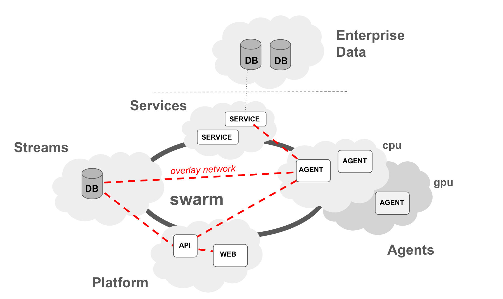

# blue

LLMs have demonstrated impressive capabilities in many tasks that go beyond traditional NLP problems, leading people to develop applications that exploit their capabilities in many domains. In these approaches LLMs play the key role (agent), planning tasks, executing tools, and retrieving necessary data.  

We see a significant shift towards AI systems, where LLMs still play an important role but they are part of a large software infrastructure, with a multitude of components (agents and beyond) to plan and break-down complex tasks, to discover and query proprietary data, and to exploit proprietary models and services, all functioning properly together with an underlying system that orchestrates the flow of data and control among components. 

Blue is an orchestraion platform to coordinate data and work among components of an AI system. We are building Blue to explore a design space where the LLM plays a key role but not necessarily they are the 'be-all and end-all'. This is in contrast to other approaches where everything is baked into LLMs; LLMs act as planner, LLMs act as the orchestrator, LLMs decide what and how to interface with services, tools, and data. 


In Blue, key components of the AI system are: 
- data lake(s) to store and query data from, consisting of a multitude of databases 
- data registry, serving as a metadata store for data sources, with capabilities to discover and search data, and eventually query data from the sources
- data planner(s), modeled as an agent, utilizing metadata (performance and beyond) in the data registry, provide crucial functionality to generate query plans
- agent registry, serving as a metadata store for agents, with capabilities to search agent metadata (e.g. descriptions, inputs, outputs)
- agent(s) providing a wide range of functionality, from calling APIs, interfacing with LLMs, to running predictive models, etc. 
- task planner(s), also modeled as an agent, taking initial user/agent input and creating execution plans, utilizing metadata in the agent registry, as well as basic operators to serve as glue between inputs and outputs.
- task coordinator(s), modeled as an agent,coordinate and monitor execution progress, once a plan is created. 
- operators, supporting the need for basic common capabilities such as data transformation and beyond, as executable functions accessible to the coordinator to invoke
- orchestration, supporting infrastructure and streams to govern the flow of data and instructions among all agents within a user session
- a conversational user interface where users can create sessions, add agents to their conversation, interact with them, and accomplish tasks.
- a python API to allow other modalities where a multi-agent system can be utilized programatically, such as developing APIs.


# orchestration, concepts

## streams
The central "orchestration" concept in Blue is a `stream`. A stream is essentially a continuous sequence of messages (data, instructions) that can be dynamically produced, monitored, and consumed. For example, a temperature sensor can spit out the current temperature every minute to a stream. In our context, a user typing in text in a chat, for example, asking a question can be a stream, where each word is transmitted as they are typed. An LLM generating text can be another stream, and generated text can be output as they are being generated. 


In blue, streams are used in multiple places. Agents consume streams and produce their output into streams. Sessions are also streams, with messages announcing agents joining and leaving as well as new streams produced in the session. As such streams are the main way of passing data and instructions between agents, where an agent can produce a stream (data and instructions) and another agent can consume from the stream. 

Messages can be data and instruction messages, with supported data types of integer, string, and JSON objects.

## agents
The central "compute" concept in blue is an agent. An agent basically spawns a worker to monitor to a stream, if it decides to act on it, can process the data and produce output in another stream. There might be yet another agent monitoring the output of the first agent and do something on top or choose to listen to the user stream. 


### worker
A worker is a thread of an agent that is basically dedicated to a specific input stream and outputs to a specific output stream.

## session
The central "context" concept in Blue is a `session`. A session is initiated by an agent, usually a user agent input into a stream, and continiously expanded by other agents responding to the initial stream and other streams in the session. Agents are added to a session to orchestrate a response to the initial user input. Once added an agent can listen to any `stream` in the session and decide to follow-up and process data in the stream to produce more streams in the session.

## memory
Agents (i.e. agent workers) can store and share data among each other. Data is stored and retrieved in three levels of context: (a) session (b) stream (c) agent and (d) workers. A worker can put data into the session store which can be seen and retrieved by any agent and worker in the session. A worker can further limit the scope of the data to a stream, where data can be seen only by agents which are working on a specific stream. Finally, a worker can put private data where it can only be seen by the worker itself, or more broadly by all workers in the agent.


# development

Blue can be deployed in two modes: (1) `localhost` (2) `swarm` mode. `localhost` is more suitable for development and `swarm` mode is more suitable for staging and production. Below we describe how you can deploy blue in `localhost` mode and further down we will talk about `swarm` mode as we discuss production.

## requirements
Blue requires docker engine to build and run the infrastructure and agents. To develop on your local machine you would need to install docker engine from 
https://docs.docker.com/engine/install/

## configuration

Most of blue scripts require a number of parameters. While you can use defaults, configuring your setup can be more easy, if you set environment variables for your choices. Below is the list of environment varibles:

- `BLUE_INSTALL_DIR`, directory containing blue source code, for example, `/Users/me/blue`
- `BLUE_DEPLOY_TARGET`, deployment target, localhost (default) or swarm
- `BLUE_DEPLOY_PLATFORM`, platform name, default (default)
- `BLUE_PUBLIC_API_SERVER`, server address for the REST API , for example, `http://localhost:5050`
- `BLUE_DATA_DIR`, directory hosting daa for blue services, for example `${BLUE_INSTALL_DIR}/data`

Use of utilities such as [direnv](https://direnv.net/) is strongly encouraged to help management environment variables.

## setup

A data volume is added to several services (agents, API, etc.) where common data such as models can be stored within a platform (e.g. `default`). To create a data volume on your development environment, run:

```
$ cd platform/scripts
$ ./create_data_volume.sh --data default
```

This will create a directory called `default` under the `$BLUE_DATA_DIR` directory, and create a volume on that directory.

## build

Even when running blue locally during development, many components of blue will run in docker containers. It is important to build the various docker images first.

### building agents

To build docker images for all agents, run:
```
$ cd agents
$ ./docker_build_all_agents.sh
```

Or if you can also build images for certain agents, you can do so by first changing to the directory for the agent, for example, to build user agent only:
```
$ cd agents/user
$ ./docker_build_agent.sh
```

### building platform components


## deployment

To deploy blue locally, with the default options, run:
```
$ cd platform/scripts
$ ./deploy_platform.sh
```

To test your deployment you can run:
```
$ docker ps
```

and the list should contain three containers running: redis, api , and frontend

If you want to see it in action on the web, you can bring up the frontend by browsing to `http://localhost:3000`

## examples, demos

### v0.1 example
To try out demo of v0.1, run the following commands:
```
$ cd agents/simple_user
$ python src/simple_user_agent.py --interactive
[...]
INFO:root:Started consumer USER for stream SESSION:493e2083-61a0-4c90-accf-3d372f5b8aac
Enter Text: Hello, this is a really long message. Kidding not really.
```
Then copy the session the USER agent created (i.e. SESSION:493e2083-61a0-4c90-accf-3d372f5b8aac)  so that another agent can participate in the same session:
```
$ cd agents/simple_counter
$ python src/simple_counter_agent.py --session SESSION:493e2083-61a0-4c90-accf-3d372f5b8aac --loglevel ERROR
[...]
```
In the above example, the user enters some text and another agents listens to the sesssion the user agent works in, when the user agent creates a stream and enter text, the counter agent above picks up the stream and computes the length of the user stream and outputs that into another stream in the session.. You can see the demo stream contents using RedisInsight or use Observer agent (see below).

A more sophisticated example would be where an agent talks to a service over websockets. To run an example like that you first need to bring up a web service and then run the agent that talks to the service. Let's first build the service as a docker image:

```
$ cd agents/websocket_counter
$ ./docker_build_service.sh
```

Then run the service:
```
$ cd agents/websocker_counter
$ docker compose up
```

And lastly run the agent:
```
$ cd agents/websocket_counter
$ python src/websocket_counter_agent.py --session SESSION:493e2083-61a0-4c90-accf-3d372f5b8aac --loglevel ERROR
```

As a matter of fact, not just the services for the agents, the agents themselves can also be run in a dockerized manner. To do so, run the `docker_build_agent.sh` in the respective agents folders. This should be docker images such as `blue-agent-websocket_counter`, which you can list using `docker image ls`, for example.

To run dockerized version of the agents you would need to run `docker run` commands with the image names and parameters. For example, the agents in v0.1 examples can be as below:
```
$ docker run -e text="this is a different text" --network="host" blue-agent-simple_user
$ docker run -e session=SESSION:493e2083-61a0-4c90-accf-3d372f5b8aac --network="host" blue-agent-simple_counter
$ docker run -e session=SESSION:493e2083-61a0-4c90-accf-3d372f5b8aac --network="host" blue-agent-websocket_counter
```

## agent development

Let's dive into a bit of development of the agents. The `agents/lib` contains an Agent class that can be used as a base class for developing new agents. You do not necessarily need to extend the base class to create a new class for an agent as you can use the Agent class directly, and use the APIs to process data from other agents. Let's go through an example that basically uses base class:

```
# create a user agent
    user_agent = Agent("USER")
    session = user_agent.start_session()

    # sample func to process data for counter
    stream_data = []

    def processor(stream, id, label, data):
        if label == 'EOS':
            # print all data received from stream
            print(stream_data)

            # compute stream data
            l = len(stream_data)
            time.sleep(4)
            
            # output to stream
            return l
           
        elif label == 'DATA':
            # store data value
            stream_data.append(data)
    
        return None

    # create a counter agent in the same session
    counter_agent = Agent("COUNTER", session=session, processor=processor)

    # user initiates an interaction
    user_agent.interact("hello world!")

    # wait for session
    session.wait()
```

In the above example, a `USER` agent is created and `create_session` function on the Agent is called to create a Session object. That session object is passed to another Agent, called `COUNTER`, along with a `processor` function to process data in the `COUNTER` agent. 

The signature of the `processor` function is `stream`, `id`, `label`, and `data`. `stream` is the input stream to process, `id` is the data id assigned (by Redis) stream. `label` is the label of data in the stream, for example `BOS` for beginning of stream, `EOS` for end of stream, `DATA` for a data in stream. Essentially above `processor` function adds new data to `stream_data` when it receives new data (e.g. on `DATA` label) and returns count when all data is received (e.g. on `EOS` label). The base class `Agent` automatically creates a new stream in the session and adds the returned value from the stream so that other agents might start listening to new streams and data in the session.

In the end, upon running the above code the streams in the session will be:

| SESSION:493e2083-61a0-4c90-accf-3d372f5b8aac                   |
| ---------------------------------------------------------------|
| label: BOS                                                     | 
| label: ADD, data: USER:c124ca2b-6602-4bdf-882e-f45518d30c85   |
| label: ADD, data: COUNTER:44d7b977-eb7f-4d7f-8c33-8b3d2b11c3c2|

| USER:c124ca2b-6602-4bdf-882e-f45518d30c85 |
|-------------------------------------------|
| label: BOS                                |
| label: DATA, data: hello, type: str       |
| label: DATA, data: world!, type: str      |
| label: EOS                                |

| COUNTER:44d7b977-eb7f-4d7f-8c33-8b3d2b11c3c2 | 
|----------------------------------------------|
| label: BOS                                   |
| label: DATA, data: 2, type: int              |
| label: EOS                                   |

First stream refers to session stream, specifically when a new stream is generated by an agent, all others can get which stream is generated and who generated it.

Second stream refers to the output from the `USER` stream, essentially the text entered: `hello` and `world!`

Third stream refers to the output from the `COUNTER` stream, essentially the count of the tokens in the `USER` stream, as processed and returned by the agent.

That is it!

Not quite. One question is who is listening to who. To decide which agents to listen to agents have a `listens` property and `includes` and `excludes` list. Basicall agents tag each stream they produce and others in the session can check they `includes` and `excludes` list against the tags of the stream. Agents by default tag each stream they produce by their own name. Addition tags can be provided as a property (`tags`).  `includes` and `excludes` lists are ordered lists of regular expressions that are evaluated on stream tags (e.g. USER, ). To decide if an agents should be listened to first the `includes` list is processed. If none of the regular expressions is matched, the stream with the tags is not listened to. If any of the regular expressions is a match, a further check is made in the `excludes` list. If none of the `excludes` regular expressions is matched the stream is listened. If any one of `excludes` is matched the stream is not listened to. Default `includes` list is ['.*'], i.e. all agents are listened to, and the default `excludes` list is [self.name], i.e. if it is self it is not listened to. Both include and exclude list can include an element that is itself a list, e.g. `["A","B",["C","D"]]` to support conjunctions. For example, in the previous example both "C" and "D" tags (or regular expressions) need to match.
    
That is it, for now. :) 

### memory 
The above example works if there is only one worker and that worker is solely responsible from start to end (i.e. it doesn't fail). The reason is that in the above example `stream_data` is a shared variable among all workers of the agent, even when they worker on a different stream. To resolve this issue, you need to create distributed memory (uses Redis JSON) that a worker can write its private data that is only specific to a stream. 

As discussed above there are three levels of data context. Below are API functions for reading and writing in these respective context. To allow this you will need to pass worker as a keyword parameter to the processor function, i.e. 
```
def processor(stream, id, label, data, worker=None):
```

and use the following worker functions to write data.

For private worker/stream you can call the following functions on the keyword parameter `worker`, `set_data(key, value)`, `append_data(key, value)`, `get_data(key)`, and `get_data_len(key)`. For example, worker.set_data('a', 3), and worker.get_data('a'). The value can be any JSON value. 

To share data among workers from the same agent, you can use `set_agent_data(key, value)`, `append_agent_data(key, value)`, `get_agent_data(key)`, and `get_agent_data_len(key)`.

To share data among workers processing data from the same stream, you can use `set_stream_data(key, value)`, `append_stream_data(key, value)`, `get_stream_data(key)`, and `get_stream_data_len(key)`.

To share data among all agent works in the session, you can use `set_session_data(key, value)`, `append_session_data(key, value)`, `get_session_data(key)`, and `get_session_data_len(key)`.


## generic agents

Beyond the basic proof of concept agents below we document agents we develop that are a bit more useful for a variety of tasks. 

### api
APIAgent is a generic Agent that is designed to be a base class for a variety of agents that essentially talk to an API. To support this it has a number of properties designed to construct a message to the API from input and other properties and parse response from the API to build the right output. Below are the properties to support this:

`input_json`: Initializes input if JSON is the input format. When set to None, input is just text. Otherwise JSON is constructed from the value of this property and input is plugged in to the right place in the input json using below properties. 

`input_context`: Defines where in the input json input is plugged in using JSONPath.

`input_context_field`: Defines the input field name where input is plugged in.

`input_field`: Defines the input field of the API call. Input is set as the value of this property, as constructued from above process for constructing input. 

`input_template`: Defines the template of the input using a template. When set to None it is assumed that input is passed on without an additionally formatting. Otherwise, `input_template` is expected to be of the following format: `.....{var1}....{input}....{var2}...` where `var1` and `var2` is substituted from the corresponding properties of the agent, and `input` is coming from the input stream. 

`output_path`: Define where in the API response to find the output using JSONPath. For example, `$.result` would point to the `result` property in the response JSON.

`output_template`: Defines the template of the output (in a similar fashion as in `input_template` using a template. When set to None it is assumed that output is returned without an additionally formatting. Otherwise, `output_template` is expected to be of the following format: `.....{var1}....{output}....{var2}...` where `var1` and `var2` is substituted from the corresponding properties of the agent, and `output` is coming from the response, extracted through `output_path`. 

### openai
OpenAI has a number of models available through APIs. OpenAI agent is basically a wrapper around models offered. The agent has a webservice component that works with the APIs. To create an OpenAI agent:
```
$ cd agents/openai
$ python src/openai_agent.py --session <session_id> --properties '{"openai.api":"ChatCompletion","openai.model":"gpt-4","output_path":"$.choices[0].message.content","input_json":"[{\"role\":\"user\"}]","input_context":"$[0]","input_context_field":"content","input_field":"messages"}'
```
As you see above details of the model (e.g. `gpt-4`), api (e.g. `ChatCompletion`), etc. are provided as input to the agent. In addition to prepare input data for the API and to fetch response you need to provide additional properties such as `input_field`, `input_context`, `input_concext_field`, and `output_path`. `input_field` is the name of the field to where text data is provided to the API (e.g. `prompt` for `text_davinci_003`, `messages` for `gpt-4`). `output_path` is json_path to where the API returns the resulting text in the response (e.g. `$.choices[0].message`). Some of the API calls require more structured input such as `ChatCompletion`. The JSON structure is specified in `input_json`, and where to insert input text data is provided as json_path in `input_context` and the associated input field name is provided in `input_context_field`. Note that any properties with the prefix `openai.` will be passed on to OpenAI API, everything else is used by the agent itself for data processing.

For the OpenAI agent you would also need to start a webservice that will proxy to OpenAI APIs . To start the service :
```
$ cd agents/openai
$ docker compose up 
```

Finally, to setup openai authentication, edit `openai.env` and replace `<openai_api_key>` with your API Keys. 

### nl2sql
OpenAI has models (e.g. 'text-davinci-003') that can convert natural language statements to SQL queries, optionally given a schema. To bring NL2SQL agent, all you need to do is to pass in properties that will allow OpenAI to make the proper calls, with the right prompts, and input/output processing:
```
$ cd agents/openai
#  python src/openai_agent.py --properties  '{"openai.api":"Completion","openai.model":"text-davinci-003","output_path":"$.choices[0].text","input_field":"prompt","input_template":"### Postgres SQL tables, with their properties:\n#\n{schema}\n#\n###{input}\nSELECT","openai.max_tokens":100,"openai.temperature":0,"openai.max_tokens":150,"openai.top_p":1.0,"openai.frequency_penalty":0.0,"openai.presence_penalty":0.0,"openai.stop":["#", ";"],"schema":"","output_template":"SELECT {output}"}' --session
```

As you can see above details of the model (e.g. `text-davinci-003`), api (e.g. `Completion`), etc. are provided as input to the agent. Beyond what is discussed above there are other properties that are needed to process input and ouput appropriately. For example, to set the prompt that also takes in a schema you can set `input_template` and provide additional attributes that can be set from properties. Above we initialize a prompt string that takes in `schema` and `input` as attributes. `input` is set by the agent, which is essentially input stream data, i.e. user query. `schema` is set in the agent properties (above just initialized to empty string). Siimilarly, `output_template` defines what to put back into the stream. Above a prefix (e.g. `SELECT `) is prepended to data coming from the model so the complete query can be obtained. 

As above to run the agent you will need to start the service.

### postgres 
Postgres Agent essentially scans a stream for any valid SQL statements and executes the query against its database. To bring up a Postgress agent, you need to provide properties such as host name, port, database, etc. For example:
```
$ cd agents/postgres
# python src/postgres_agent.py --properties  '{"postgres.user":"postgres", "postgres.password":"example", "postgres.database":"mydatabase", "postgres.host":"host.docker.internal"}' --session <SESSION>
```
Note that any properties with the prefix `postgres.` will be passed on to Postgress service, everything else is used by the agent itself for data processing and preparation.

For the Postgress agent you would also need to start a webservice to execute queries on Postgres . To start the service :
```
$ cd agents/postgres
$ docker compose up 
```

The postgress database itself is part of the blue platform, and it runs when you bring up the platform services (as noted above in infrastructure)

### neo4j 
NEO4J Agent essentially scans a stream for any neo4j/CYPHER query statements and executes the query against its database. To bring up a NEO4J agent, you need to provide properties such as host name, etc. For example:
```
$ cd agents/neo4j
# python src/neo4j_agent.py --properties  '{"neo4j.user":"neo4j", "neo4j.password":"neo4j", "neo4j.host":"bolt://host.docker.internal"}' --session <SESSION>
```
Note that any properties with the prefix `neo4j.` will be passed on to NEO4J service, everything else is used by the agent itself for data processing and preparation.

For the NEO4J agent you would also need to start a webservice to execute queries on Postgres . To start the service :
```
$ cd agents/neo4j
$ docker compose up 
```

The neo4j database itself is part of the blue platform, and it runs when you bring up the platform services (as noted above in infrastructure)

### observer 
Observer Agent essentially consumes every stream in a session and outputs the contents into a readable format that can be used for demo and debugging purposes. To bring up an Observer agent, all you need is to pass the session to observe. For example:
```
$ cd agents/observer
# python src/observer.py  --session <SESSION>
```

### recorder 
Recorder Agent essentially consumes every JSON stream in a session to find matches and writes them to session memory for every agents consumtion. `records` property is an array of records which consists of `variable`, `query`, and `single`, where the recorder agent executes JSONPATH query in `query` and assigns it to `variable` in the session. When a variable assignment is made it is announced in the recorder's stream.
```
$ cd agents/recorder
# python src/recorder.py --properties '{"records":[{"variale":<name>,"query":<jsonpath_query>},...]}' --session <SESSION>
```

# staging, production

The main difference between a `localhost` deployment and a `swarm` deployment is that there are multiple compute nodes where various components can be deployed to. 

## clusters

All above (expect data lake) is hosted on a compute cluster where at deployment time containers for Redis, API, and frontend are started. Agents containers are started on demand from the api and are also hosted on the compute cluster.

The mapping various components to the compute cluster is done through deployment constraints. In the current setup the cluster has nodes with labels: db, platform, and agent. 
Redis container is deployed on the db nodes, API and frontend deployed on the platform node, and agent containers are deployed to the agent node. Communication between the various components is done through an overlay network dedicated to the plaform.

Each deployment of the platform is named, with a separate network so that each component in the platform is addressible using the same hostname within its specific network, as shown below:



## requirements

## configuration

## setup

### swarm setup

First, you need to create multiple compute (e.g. AWS EC2) instances. For this step, please refer to your cloud providers documentation. For AWS, you can find it here: https://aws.amazon.com/ec2/getting-started/. In addition, to allow some easy data sharing you can create a filesystem to share among the compute instances. For AWS EFS, refer to: https://aws.amazon.com/efs/getting-started/. 

Once you have several compute instances, you can build a swarm consisting of manager and worker nodes. As part of blue platform scripts, we have convenience scripts to help you initiate a swarm, add nodes, and label them for blue deployments. For more details on swarm you can read: https://docs.docker.com/engine/swarm/

To initiate a swarm, run below command on the designated manager node:
```
$ cd platform/scripts
$ ./init_swarm.sh
```

Once completed, you will have the manager and worker tokens saved as `.manager.token` and `.worker.token`.  You can then use to go to other compute instances and join the swarm. You can either copy these files or share them via shared filesystem:

Before running below commands make sure `.manager.token` and `.worker.token` files are transferred and are in the same directory.

To join as worker, run:
```
$ cd platform/scripts
$ ./join_swarm.sh worker
```
To join as manager run `./joinswarm.sh manager`. To leave swarm run `./leave_swarm.sh`

Once all nodes are in the swarm, label them so that when blue is deployed they go to the appropriate node. Blue uses by default three labels: `platform`, `db`, and `agent`

For each node label them with one of the above labels:
```
$ cd platform/scripts
# ./add_label.sh <label> <node>
```
where <label> is either `platform`, `db`, or `agent` and <node> is the node id when you run `docker node ls`.

## build 

## deployment


## Changes
Below is a list of recent changes:
* [9/7/2023]: recorder agent
* [9/7/2023]: agent can tag streams
* [9/6/2023]: observer agent
* [9/6/2023]: neo4j agent
* [9/6/2023]: --loglevel parameter
* [9/1/2023]: agent level memory
* [9/1/2023]: include/exclude lists
