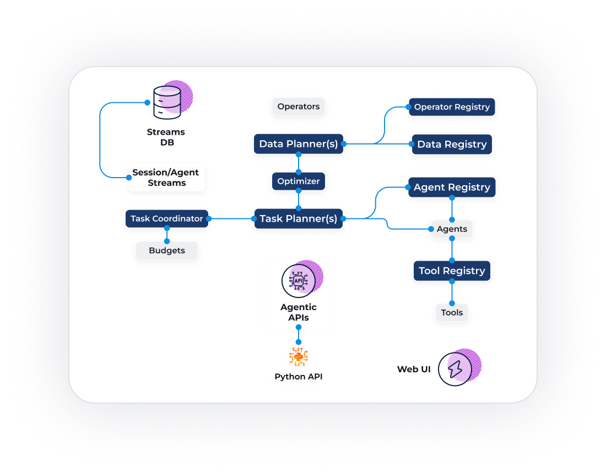
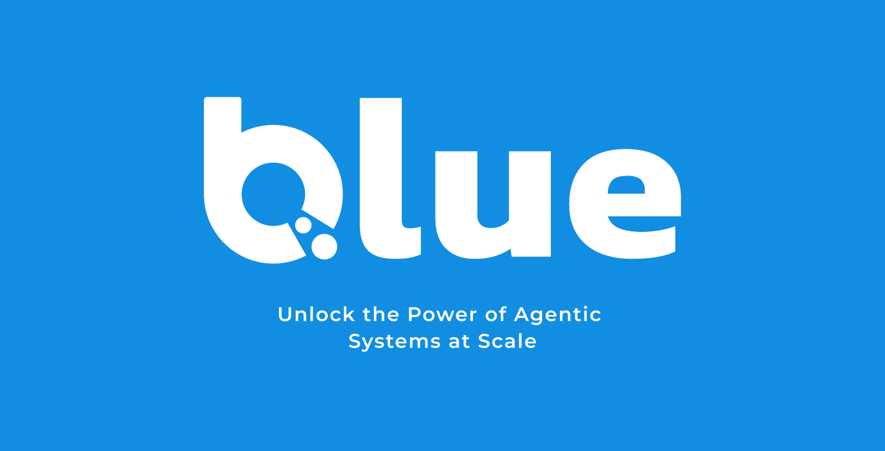

## What is Blue?

Blue is Megagon’s open-source framework for building enterprise-ready agentic workflows, known as compound AI systems that orchestrate agents, data, and tools across your existing stack. Its core orchestration is done via <a href="https://megagon.ai/streams-orchestrating-work" target="_blank">**streams**</a>, which carries data and instructions between agents with structure and control, so you can scale from prototypes to production without throwing away what you already run in the enterprise.

Blue provides robust task reasoning and execution over multimodal datasets. While it is designed to integrate with enterprise-level systems, it is a blank canvas for your own specific needs and creative, agentic impulses.

<h3 align="center">
  <a href="quickstart.html">Get started</a>
</h3>

## Blue Architecture

[**Streams**](references/blue/stream.md)**:** Streams distribute data and tasks among agents, making complex workflows scalable and easy to debug.

[**Data Planner**](references/blue/data/planner.md)**:** Break complex queries into several operators across structured and unstructured data to improve speed, cost, and accuracy.

**Task Planners** **:** Decompose and prioritize tasks, coordinate agents, and explain results so workflows execute like expert teams.

[**Data Registry**](registry.md#data-registry)**:** Seamlessly connect agents to private and public multimodal data sources. 

[**Agent Registry**](registry.md)**:** Find and reuse vetted agents and tools across your projects to build reliable, reproducible workflows at any scale.

[**Tool Registry**](registry.md#tool)**:** Register and integrate custom or public tools—including MCP servers—so agents can access resources across workflows.

  

## What you can build with Blue

* **NL2SQL analytics:** Parse questions, execute queries, and summarize results with guardrails and audits.  
* **Insights \+ UX agents:** Agents that produce visualizations and interactive UI for self-service BI.  
* **Conversational apps with real services:** Blend dialogue, planning, and deterministic API calls.   
* **Text & multimodal pipelines:** Extract, transform, and join across structured and unstructured data with reproducible steps.

## Learn more

* **Source code (v1.0):** <a href="https://github.com/megagonlabs/blue" target="_blank" rel="noopener noreferrer">Browse concepts, examples, and deployment docs.</a>  
* **Product overview:** <a href="https://megagon.ai/blue/" target="_blank" rel="noopener noreferrer">What Blue is and  why it’s “agentic for enterprise.</a>
* **Design principles:** <a href="https://megagon.ai/blue-designing-agentic/" target="_blank" rel="noopener noreferrer">The “Agentic for Enterprise” foundations.</a>
* **Streams deep-dive:** <a href="https://megagon.ai/streams-orchestrating-work/" target="_blank" rel="noopener noreferrer">Why stream processing is the right abstraction for orchestration.</a> 
* **Blueprint architecture (paper):**  <a href="https://megagon.ai/publications/a-blueprint-architecture-of-compound-ai-systems-for-enterprise/" target="_blank" rel="noopener noreferrer">A Blueprint Architecture of Compound AI Systems for Enterprise</a>

  

