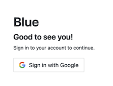

# Getting Started
## Installation
 There are two Blue installations options:
  * [Local Installation](/LOCAL-INSTALLATION.md) more suited for trying out and development 
  * [SWARM Deployment](/SWARM-DEPLOYMENT.md) more suited for staging and production deployment

## Login
### How to login
To login:
- Open a web browser and enter the URL of your instance.  
  If you have installed locally and accepted the default configuration, the url will be http://localhost:3000. Otherwise, it is http://`BLUE_PUBLIC_WEB_SERVER`:`BLUE_PUBLIC_WEB_SERVER_PORT`

- Click on `Sign in with Google` and please sign in using your google account. 

  

- <u> For administrator users </u>
  
  Please sign in with the google account you used during the [installation process](/LOCAL-INSTALLATION.md).
- <u> For new users </u>
   
  Please sign in using a google account within the whitelisted email domain defined in the configuration `BLUE_EMAIL_DOMAIN_WHITE_LIST` set during the [installation process](/LOCAL-INSTALLATION.md).  Note: by default new users are created with guest role.  Administrators can grant administrator role access using `Navigation menu > Users` 

- Home screen should appear once you have logged in successfully. 

### Role Based Permissions
Blue supports role based permissions. For more information please refer to [Access Controls](/ACCESS-CONTROL.md)
