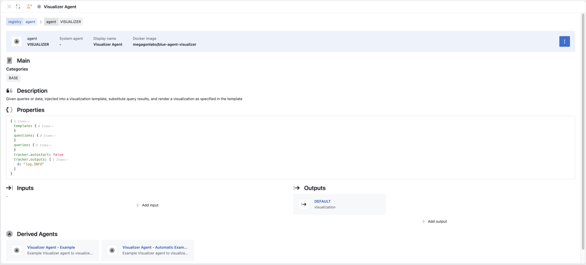
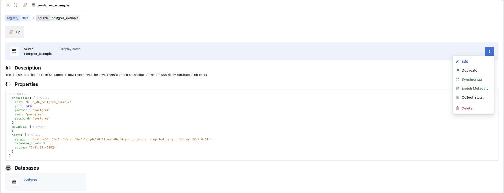
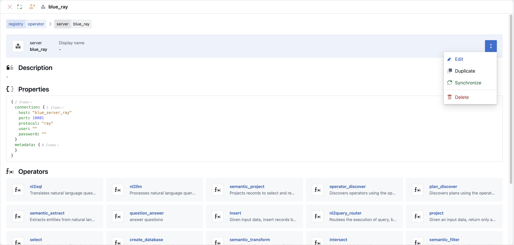
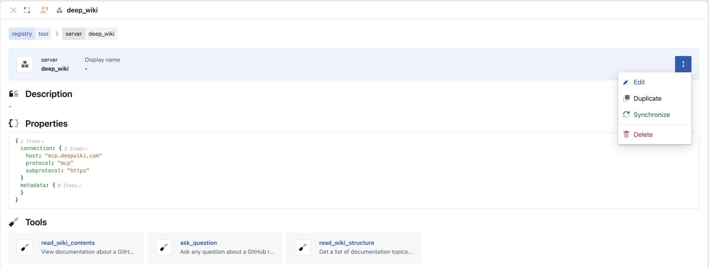

# Registry

## Agent Registry
The agent registry represents available agents across the enterprise that have gone through extensive evaluation. As such enables application builders and task planners to leverage agents and tools tailored to their specific needs, ensuring reliable and reproducible results at scale, even for large and complex applications. 

Access the agent registry by clicking on `Navigation Menu > Agent`

### Agent Registry Configuration

  

When setting up an agent you will need to define

* Agent Definition
  * Name: Name of the agent and a display name 
  * Docker image: name of the agent docker image 

* Properties: the properties of the agent enables you to configure the main characteristics of the agent.  This varies by the different agents but can include such properties as prompt templates, output transformations, model parameters.   

* Input/Output
  * Input: Tags that the agent listens to or excludes
  * Output: Tags the output so subsequent agents can listen for the relevant tag

* Derived Agents
  * Derived agents enable you to create a different variation of the parent agent.  It inherits configuration from their parent agent and you can override inherited properties, inputs, and outputs.  

## Data Registry
The data registry enabled blue to seamlessly connect to your private structured and unstructured data, relational databases, public data sources and beyond. Data registry allows agents to search, discover and access the most relevant data, enabling effective use of different data sources across tasks

Access the data registry by clicking on `Navigation Menu > Data`

### Data Registry Configuration

  

When setting up an data source you will need to:
* Data Definition
  * Source: Name of the data source and a display name 
  
* Properties: the properties of the data source enables you to configure the main characteristics of the data source including connection settings and the protocol being used.

* Synchronize:  Click on `More > Synchronize` to synchronize the data registry entry with the data source.  This will connect to the data source a extract the data schema and enables agents to discover structure of the data source

* Enrich Metadata: Click on `More > Synchronize` to enrich the data registry entry with the data source metadata.  Along with the data schema, data source metadata enables agents to discover structure of the data source.

* Collect Stats: Click on `More > Synchronize` to enrich the data registry entry with summary statistics of the data source.  

## Operator
The operator registry enables blue to execute reliable data operations for structured and unstructured data - locally or distributed with Ray.

Access the operator registry by clicking on `Navigation Menu > Operator`

### Operator Registry Configuration

  

When setting up an operators you will need to:
* Operator Definition
  * Server: Name of the operator server and a display name 
  
* Properties: the properties of the operator enables you to configure the main characteristics of the operator including connection settings and the protocol being used.

* Synchronize:  Click on `More > Synchronize` to synchronize the operator entry with the available operators and their properties. 

## Tool
The tool registry enables enterprise applications to leverage tailored tools and supports integration with MCP servers to access publicly available tools and resources.

Access the Tool registry by clicking on `Navigation Menu > Tool`

### Tool Registry Configuration

  

When setting up a tool you will need to:
* Tool Definition
  * Server: Name of the tool server and a display name 
  
* Properties: the properties of the tool enables you to configure the main characteristics of the tool including connection settings and the protocol being used.

* Synchronize:  Click on `More > Synchronize` to synchronize the tool entry with the available tools and their properties. 