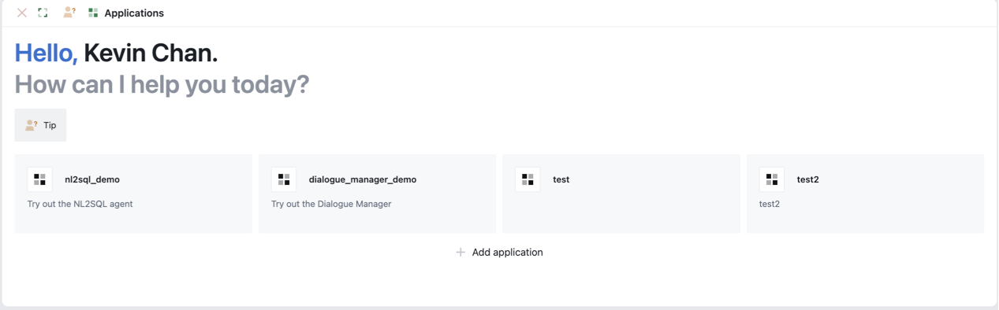
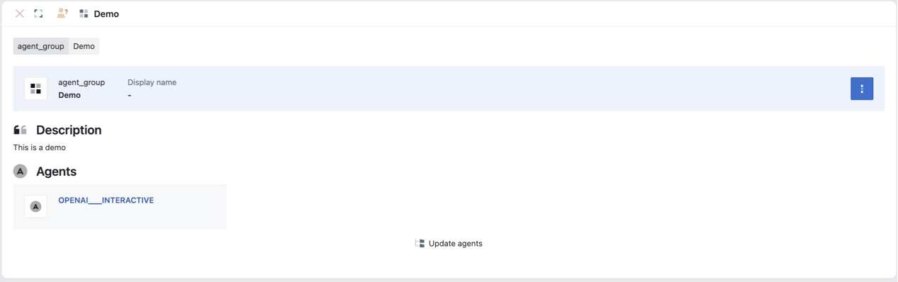
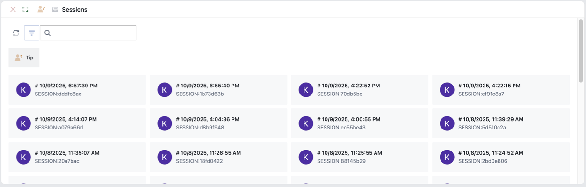
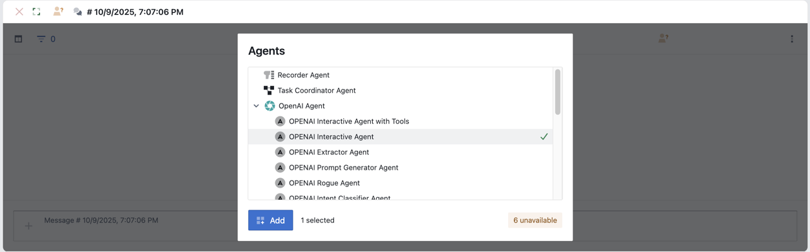
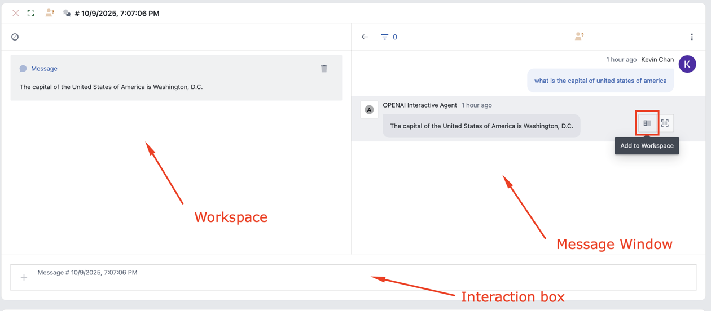
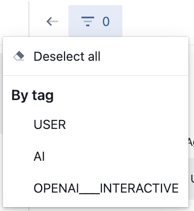
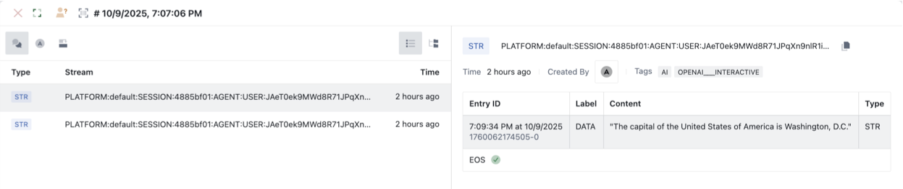
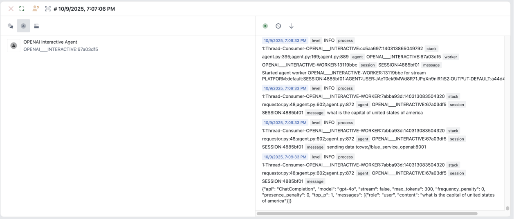
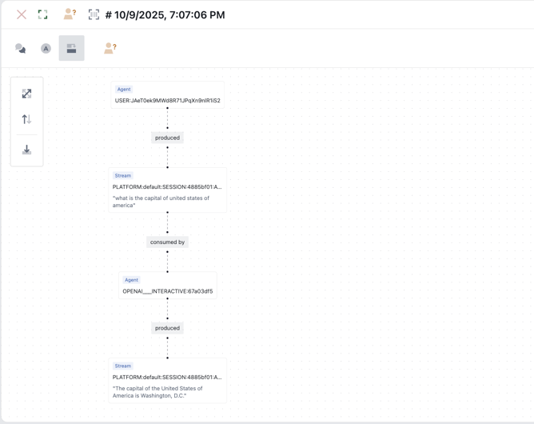

# Sessions
## Applications
The "Applications" page shows predefined agent groups enabling users to create a new session with the correct agents included  

To access the applications page
- Click on `Navigation menu > applications`
  

  

- Displayed are cards of the predefined agent groups in the system
  Agent groups allow you to define the agents that will be used when the users start a application session.  

To create a new session with a predefined agent group.
- Double-click on the agent group card
- A new session is created with the agent group configuration

## Add New Agent Group
To add a new agent group
- Click on `Add application` button

- Fill in the following fields
  - Name
  - Description
- Click on the create button
- To add agents to the agent group, right click > edit
    

  

- Click on `Update agents` button
- Select the relevant agents and click `add` button
- Click on the close button on the top left

## All Sessions
The "All Sessions" page shows all the existing sessions that have been created in the system.

To access the applications page
- Click on `Navigation menu > All Sessions`
  

  

To find a session you can
- Use the search box to search for a session with a session id
- Use the filter button to filter on: All, My or Shared sessions

To open a existing session 
- Double-click on the session card

Tip: When hovering over a session card, you can click on the pin button to pin the session at the top of the sessions shown

## New Session
To open a new session:
- Click on `Navigation menu > new session`

  

- Select the relevant agents for your session and click on the add button
- Once you have finished adding agents click on the done button
- A new session has now been created

Sessions window enabled users to interact with the system

Interaction box allows the user to input messages in natural language

## Interact With Session 

  

* Input user requests in natural language via the interaction box.
* Responses/output and interaction history will be displayed in the message window
* At any time you can pin any response/output to the workspace by clicking on the `Add to workspace` button on the right of a message.  This enables you to keep the response/output visible while the message window continues to add interaction history.  

Tip: 

* View the sessions details by clicking on `more > open session details`

* Delete a session by clicked on `more > open session details`.  Goto `Settings` tab and click on `Delete this session` button

## Advanced Users

### Filter Messages

Filter on messages with specific tags by clicking on the filter button. 

  

### Debug session

Debug a session by clicking on `more > inspect`.  There are three types of session debugging available

#### Debug: Messages

Debug message screen shows a log of all the streams and messages produced in the session.  

  

#### Debug: Agent

Debug agent screen shows the agents within the session and the docker logs for each of the agents

  

#### Debug: Stream Flows

Debug stream flows screen show a graphic representation of the flows within the stream.

  

Tip:

Click on a node will highlight the immediate connecting edges 